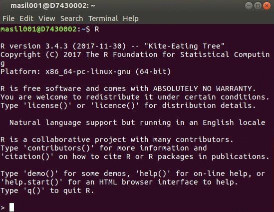

```{css, echo=FALSE}
@import url("https://netdna.bootstrapcdn.com/bootswatch/3.0.0/simplex/bootstrap.min.css");
.main-container {max-width: none;}
div.figcaption {display: none;}
pre {color: inherit; background-color: inherit;}
code[class^="sourceCode"]::before {
  content: attr(class);
  display: block;
  text-align: right;
  font-size: 70%;
}
code[class^="sourceCode r"]::before { content: "R Source";}
code[class^="sourceCode python"]::before { content: "Python Source"; }
code[class^="sourceCode bash"]::before { content: "Bash Source"; }
```

<font size="6">[WUR Geoscripting](https://geoscripting-wur.github.io/)</font> 


# Linux terminal & Bash


## Learning objectives

- Knowing how to use the *terminal*
    - Running R and Python from the terminal
- Learn the basics of *Bash* scripting and know how to create a shell script

# Using the terminal and *Bash*

There are two ways to interact with your operating system: a graphical user interface (GUI), where you point and click, and a command-line interface (CLI), where you type commands to make something happen. GUIs are simpler to use, but CLIs are more powerful and faster for some tasks, once you get used to them.

```{block, type="alert alert-success"}
> **Question 1**: What are the advantages of using CLI? Can you think of some examples?
```

Most Linux distributions come with a *terminal*, which is a program you use to run CLI programs. You might know the *Command Prompt* program on Windows: that is a type of *terminal*. On Linux, there is a variety of terminal applications to choose from. You can start one on your virtual machine by clicking on *Applications* → *System Tools* → *Terminal*. This will look like:


A *terminal* is just a gateway to the world of CLIs, but through it you interact with a particular *shell* (or *command interpreter*) which speaks a programming language. The default shell on Linux is *Bash*, and programs written in the *Bash* language are called *Bash scripts*. Much like the *R* console, you can input commands to *Bash* line by line through the *terminal*.

*Bash* shell scripting, like also *R* or *Python*, allows multiple commands to be combined, facilitating automation. A shell script (shell program) is a text file that contains commands that are interpreted by the shell (see below, we will learn how to write a shell script). Each command can be linked in a script to combine several commands by providing the output of one as input to the other. Shell scripts can also contain the control structures common to the majority of programming languages (i.e. variables, logic constructs, looping constructs, functions and comments). The main distinction between shell programs and those written in C, C++, Java (to name but a few) is that shell programs are not compiled for execution, but are readily interpreted by the shell.

```{block, type="alert alert-success"}
> **Question 2**: What is a shell script?
```

*Bash* is not only the default shell on Linux, but also macOS, and there are versions of *Bash* that run on Windows too. It is included with Git for Windows, and in Windows 10 *Bash* is even included by default with the [*Windows Subsystem for Linux*](https://msdn.microsoft.com/en-us/commandline/wsl/about). However, without the wealth of CLI programs that Linux distributions come with, *Bash* functionality is fairly limited.

But enough theory: let's try using the terminal in practice!

## Using the terminal

Now, fire up your terminal. You get a line, stating your user name and the machine’s host name. This is called the shell prompt. It means it’s ready for you to enter a command. Let’s try something random. Type in anything, and press enter.

Most likely the system doesn't have the command you typed in! Random doesn't work: you need to remember (or look up) commands to use them!

Now, press the up arrow, and you’ll see the previous command reappear. What’s this sorcery? The up arrow key on your keyboard is for accessing the command history. The terminal saves up to 500 commands you entered, so to not type them over and over, you can look for them with the up/down arrow. The left and right arrows are for moving the cursor within a specific line, so you can edit the text in between. The terminals were designed to work with a keyboard, so you can't use your mouse to move the cursor, but you can use the Home key to go to the beginning of the line, and the End key to go to the end. Now there’s another thing – **Ctrl+V** for pasting text **doesn’t work**. You can set it up as a shortcut somewhere, but it’s usually something else, e.g. Ctrl+Shift+Insert. But you can always paste if you right-click on the terminal, and it usually tells you what is the keyboard shortcut to do so, so that you don't need the mouse every time.

Now, for us not to get the ‘command not found’ slap to the face, let’s try something simple. Type `date`.

```{bash, eval=FALSE}
date
```

There you go. Why bother looking at your built-in calendar in the clock, when you can fire up your terminal and type `date`, and see what day it is! Just kidding, it’s a simple command, the more useful/difficult ones are coming up next. The related command to `date` is `cal` – it will display the current month’s calendar.

You may also try `free`, and it will display the amount of free memory.

```{bash, eval=FALSE}
free
```

Or `df` (standing for "disk free"), to list free space on your drives.

If you’re already in the type-only mood, you can enter the command `exit` to get out of the terminal emulator instead of pressing the "x" button.

## Navigation through the file system

Here’s a diagram of what a linux root filesystem looks like:


For example, as stated in the above picture, your user directory (where you usually store your movies, music, documents etc.) is located in the */home* directory. */home* directory is located under */*. Then you have the */etc* directory, where most of the files for configuration are located.

The next command to look into is `pwd`. `pwd`, or ‘print working directory’, is a very useful command if you think you are lost navigating through the directories. At any given moment, type `pwd`, and voila! What appears is a complete pathway you took to arrive to this directory. 

Imagine yourselves walking from room to room inside a massive apartment, losing your way. `pwd` is like the breadcrumb trail leading you to your starting point, so you don’t lose your way inside the directory maze! (Bonus: [How to use pwd command in Linux](http://www.cyberciti.biz/faq/pwd-linux-unix-command-examples/))

Now you know in which directory you’re situated thanks to your usage of the `pwd` command. Now you want to take the next step and move to another directory. Let’s say you have a directory inside your home directory you want to relocate your top secret terminal operation to. For this, you use the `cd` command. `cd`, or ‘change directory’, will change the location of your working directory. How do you use it? Simple, type `cd` and the path to your directory. Let’s say, for example, you want to enter what is on WUR Windows computers known as your "M: drive" (or just a directory called `M`) in your home directory. You type `cd /home/username/M`. 

There are also some shortcuts available. If you type only `cd`, without the path following it, your terminal will change your working directory (whatever it may be) to your `/home` directory. Likewise, if you type `cd ~user_name`, it will lead you to the home directory of the specific user you stated.

Try it out yourself. Navigate to a different directory using `cd`, and when there, type `pwd` to see if everything worked as it is supposed to. Once you're done, you should have something like this displayed in your terminal:


In the example above (`cd M`), we used what is called a *relative path*. It is a path relative to your current working directory (`pwd` states that it is */home/WUR/username*), whereas typing in `cd /home/WUR/username/M` would be using an *absolute path*. An absolute path is like giving geographic coordinates (e.g. 10°N 5°E), whereas a relative path is like giving directions: "10 km to the north and 5 km to the east from where you are standing". On Linux, absolute paths always start with */*, and relative paths never start with */*.

In terms of scripting, you should *almost never use absolute paths*! This is because absolute paths are for the most part unportable: just because you have a directory called */home/WUR/username/M* does not mean that someone else who runs the code, or indeed you yourself on another computer, would have a directory with that name. Especially if it includes your username! Relative paths are more useful: your script could create a directory called *M* and not have to worry about which user it belongs to. It will be created relative to the working directory, as shown by `pwd`.

Lastly, there are two special "directories" that are present in every directory: `.` and `..`. `.` refers to the directory itself, i.e. *M/.* as well as *M/./.* and *./M* is all the same as *M*. `..` refers to the parent directory: *M/..* is the same as your working directory, as it instructs Bash to look into the directory *M* and then go back out of it again.

## Command options

Now we know how to move from one directory to another, but how do you know what directories there are for you to move between? `ls` is a command used to list files and directories in a given directory. It can be used in various ways. These various ways come with using a form of adding an *option* to our command. To make things clearer; you can simply type `ls`. But, you can also add an option, which will *modify* your command. It can come in useful when you are looking for something specific.

That’s what an option is. And formally we can write it down like this:

```
command -option argument
```

*Command* is, well, a command we write in (like `pwd`, `ls` or anything else we have learned by now).

We already stated above the purpose of an *option*. But note that it should be written exactly as it’s in the form; with a *dash* in front of it. So, if the option is `l`, you should put `-l` after the command.

An *argument* is an object upon which the command operates (in this case, it will be directories, as we are learning how to navigate through them).

So, let’s try out `ls`, and use it on the `/etc` directory in the root of the filesystem. This time, without any options.

```{bash, eval=FALSE}
ls /etc
```
```{bash, eval=FALSE}
ls /etc | head
```

There you go, a whole bunch of files. It also sorts them by colours. The blue ones are directories, the white ones are regular files, the green ones are executable files. There are more colours, as they represent different file types.

Next, you can use the same command, but with an option `-l` added. Option `-l` will list the same files and directories, but in a *long format*. In case you need more information:

```{bash, eval=FALSE}
ls -l /etc
```
```{bash, eval=FALSE}
ls -l /etc | head
```

So, using the long format, you see much more information, and some crazy looking signs like `-rw-r–r–` at the beginning of all lines. Actually, here’s a scheme, representing what all of the given information actually means:


File Name is the name of the file. Modification time is the last time the file has been modified. Size is the size of the file in bytes. Group is the name of the group that has file permissions along with the owner, and Owner is the user who owns the file.

The most important one is *File Permissions*. That’s the gibberish at the beginning of every line in long format. The first character is the file type. If it’s a `d`, it means the file is actually a directory. If it’s `-`, it means it’s an ordinary file. The next three characters represent the read, write and execution rights of the file’s owner. The next three are the same rights of the group that also has access to the file, and the last three characters represent rights of everyone else trying to use the file.

So for example, if we have a file which in long format displays: `-rw-r--r--`, it means it’s an ordinary file (the first `-`), the owner of the file can read and write the file, but he can’t execute it, as it’s not an executable file (the `rw-` characters after the initial `-`), and the user group and everyone else can only read the file (you can see `r--` sequence repeating twice). If the user group had `rwx` instead of `r--`, it would mean they could read, write and execute the file.

Next option for `ls` is `ls -la ..` - this will list all of the files, as in a usual command, hidden files are not shown. It will list all files in the parent of the working directory in long format.

```{block, type="alert alert-success"}
> **Question 3**: What is the difference between `ls -l`, `ls -lh` and `ls -lh \-\-si`?
```

## Getting information about files

`less` is a command which will display a text file and let you scroll through it. For example, you’re looking for text file `os-release` in `/etc`. You have succesfully found it there with `ls /etc`, and now you want to read it. You just use `less /etc/os-release`.

How do you control `less`? Easy, with your keyboard!

`less` will display only one page of your text at a time. You can move line by line with the arrow keys. To go forward an entire page, you can press **Page Up**. To go *back* one page, you can use **Page Down**. **>** will take you to the end of the text file, while **<** will take you to the beginning of the text. `/characters` will search for `characters` inside the text (for example, if you write `/suse`, it will search for occurances of `suse` inside your text and mark them). **n** will go to the *next* occurrence of the search term, and **h** will display all your options (h as in help!). You quit less with the letter **q**.

The name `less` is a pun on the word `more`, which is a much more basic tool for displaying a text file and scrolling, because it only allows scrolling down; therefore, *`less` is more than `more`*.

The `file` command will show what kind of file is that you’re looking for, be it ASCII text, a jpg image, a bash script etc. As we performed our exercise with `/etc/os-release`, let’s use it here also.

```{bash, eval=FALSE}
file /etc/os-release
```

There you go, now you know what `os-release` is. Incidentally, it may be either an ASCII file or a link to one! It depends on your Linux distribution (version). If it's a link, try to run the command on the linked file. Now try it out with something else, and see the output.

Next, we have the commands `type` and `which`. Like `file`, they give information on the type, but they operate on commands instead of files. `which` tells you where you can find the executable that is run if you type in a command. Let's try it on the command `file`:

```{bash, eval=FALSE}
which file
```

Now we know that when we run `file`, Bash executes the program `/usr/bin/file`. How about `cd`?

```{bash, eval=FALSE}
which cd
```

What?! It seems that there is no such executable! This is because it is so common, it's built into Bash itself. `type` is a bit more clever than `which` and tells you whether a command is an executable file, or a command built into Bash itself. Let's see what it says about `cd`:

```{bash, eval=FALSE}
type cd
```

In some cases, you might have both available. Let's take a look at the command `time` that is used to measure how long a command runs for:

```{bash, eval=FALSE}
type time
```

It is also built into Bash itself. But there is another command called `time` that is an actual executable:

```{bash, eval=FALSE}
which time
```

Because the shell prefers builtins compared to executables, when you run `time` you will run the builtin version, rather than the executable version. But you can reach the executable version (which is more feature-rich!) by calling it with its absolute path:

```{bash, eval=FALSE}
/usr/bin/time -V
```

`type` and `which` will come very much in handy once we get to Python, as we will have several Python versions installed. It will help determine which version we have active.

## File manipulation

Copying, pasting files, creating directories etc. is probably easier using graphical tools, but, if you’d like to perform more complicated tasks, like copying only *.html* files from one directory to another, and only copying files that don’t exist in the destination directory, CLI just might come in handy. So, before we start with the commands themselves, let’s take a quick stop at *wildcards*. They are a set of special characters that help you pick out a set of files based on some simple rules (which characters appear in a file name, how many characters, upper/lower case characters etc.). Here’s the table:


And here are a few examples:


If you use a command with an argument containing a filename, you can use wildcards with no problem. Bash will go ahead and *expand* the wildcard into a set of all matching filenames, and the command will actually receive a set of files and not the wildcard string.

`cp` is used to copy files or directories. You can use it pretty easily: navigate to the directory you’d like to copy the files from and to, and simply do `cp file1 file2` - to copy single files, or `cp file1 file2 ... directory` - to copy files from your current working directory to the directory specified.

We can use `mv` to rename a file or directory, or to *move* a file or directory. We can use it this way: `mv filename1 filename2` - if we want to rename *filename1* to *filename2*, or `mv file directory` - if we want to move *file* to *directory*.

The `rm` command removes/deletes files and directories. Usage is pretty straightforward: `rm file` or `rm -r directory`. But, do be careful when using `rm`, as there is no undelete option (the file is erased and doesn't go to the bin), so be extra careful not to inflict unwanted damage to your system!

`mkdir` is used for creating directories. Now, create a directory called `Bash` (i.e. a directory that will contain our *Bash* scripts):

```{r, eval=FALSE, engine='bash'}
mkdir Bash
```

It should now look like this:


Now, try out the commands that you learned:

- make a directory and remove it (e.g. `mkdir namedirectory` and `rmdir namedirectory` or `rm -r namedirectory`).
- create an *R* script via `rstudio` or `rkward`, and then remove it via the terminal using `rm filename.R`.
- create another file and copy it and then remove it, etc.:

```{r, eval=FALSE, engine='bash'}
cp source_file dest_file
rm dest_file
```

- use `ls` commands and its options.

```{block, type="alert alert-info"}
**Tip**: Bash has a feature called Tab-completion. If you start writing a command or filename, pressing the `Tab` key a couple of times will give a list of suggestions for auto-completion. This is super-handy so that you never need to write filenames etc. In addition, you can recall the last commands you entered by using the up arrow key. Lastly, you can always open multiple terminals, even in tabs, by using *File* → *Open Tab*.
```

To recap so far, here's a list of most common commands:

- `pwd`: show your current working directory
- `cd`: change directory
- `cd ..`: move up one directory
- `mkdir`: create directory
- `rm` or `rm -R`: delete files or directories
- `sudo`: running programs as root (administrator/super-user), which may ask for your user pasword
- `ls`: listing files in a directory
- `cp`: copy files e.g. for backing up things or just copying. We will use these command in the scripts below.

## How to find help

### Documentation and manuals

Mostly every command has documentation that comes with it. So you’re somewhere doing your CLI thing, no access to the internet so you can’t bug people on the forums or IRC, and you need to find out how to exactly use a command. You can do it two ways. The first is the command `help`. The `help` command works with shell builtins, and not executable files. So you can pick a shell builtin, like `cd` or `time`, and simply type `help cd` or `help time`. You’ll get a helpful page printed out in your terminal, so go ahead and read what they have to offer. Here's another example:

```{bash, eval=FALSE}
help help
```

The help page shows in what ways you can use the command, what options you can use (it’s in square brackets, which means they are optional! Also, if there’s a vertical separator inside the square brackets, it means the options mentioned are mutually exclusive. Don’t use them together!)

`help` works only for the shell builtins. But most executables provide an option `--help`. As far as usage goes, it’s similar to `help`, but you have to type `--help` after the command you want to inspect. For example:

```{bash, eval=FALSE}
cd --help
```

However, `--help` is just a convention, which programs are not obliged to follow. Sometimes the option is called `-h`, and sometimes it is not present at all.

To get more information about how to use a command, most executables come with a formal documentation page. Distributions often mandate the inclusion of a manual page for every package, so the manual page is the most useful source of information. You can inspect the manual page using the `man` command. You just enter `man program`, and see what it prints out. Pick any program on your computer, and try it out. For example, let’s try `man which`. You get a file opened, split into categories. It gives you information what the program is, what it does, how you can use it etc., but it doesn’t offer examples, as it’s not a tutorial.

Manual pages are text files displayed in a pager program that allows easy scrolling. The default pager is `less`, which you have already used in the third exercise. You can also look at its manual page using `man less`. Also try `man intro`: the "Introduction to user commands", a well-written, fairly brief introduction to the Linux command line.

```{block, type="alert alert-info"}
**Optional**: You can also read the [Ubuntu documentation on CLI](https://help.ubuntu.com/community/UsingTheTerminal) to learn more, and let us know if you have questions about some commands. 
```

### Online resources

Great, now we know how to find help about specific commands! But how do we know *how* and *what* to write in the first place? Even the most experienced programmers run into these questions, so it's important to know how to find answers to them.

There are many places where help can be found on the internet. So in case the documentation is not sufficient for what you are trying to achieve, a search engine like Google is your best friend. Most likely by searching the right key words relating to your problem, the search engine will direct you to online documentation, a tutorial, or to some discussions on [Stack Exchange](https://stackexchange.com/). It is quite likely that the problem you are trying to figure out has already been answered before, and using these resources you should be able to solve your particular problem as well. However, you need to be critical about the information you find on the internet, as it may refer to old versions of the software you are using, or it may provide a workaround but not a real solution to the problem. And, of course, some of the solutions may simply not work for you.

### ChatGPT and generative AI

Another type of online resource that has recently been gaining in popularity is generative AI, such as ChatGPT. Generative AI models can be interacted with by asking it questions, including questions about programming. The AI responds by providing examples of code, explanations about what the code does, and how to run it. Of course, most AI solutions are not limited to code and will also answer questions on history, biology, quantum mechanics, and will even play Dungeons and Dragons with you, including throwing dice.

Generative AI models can be a great tool to enhance learning, as they can quickly answer specific questions and give coding suggestions. However, many of the limitations of web search apply to generative AI models as well (in fact, most of these models are something of a smart web search engine, as they are trained on a lot of text found on the internet). Therefore, you need to be very critical of AI-generated answers. The code that the AI generates may seem like it would solve your problem, but it may also do something incorrectly, such as calling functions that are no longer available, or even making them up altogether. Many generative AI solutions, including ChatGPT, are unable to provide references for their statements, and when asked, will make up a list of references and links that do not exist in reality. They may also answer questions completely wrong, but the explanation that they provide usually sounds quite convincing, therefore it may mislead you or make you second-guess yourself. When generative AI models are confronted about a wrong answer, they often insist that it is correct, and the longer you talk with a generative AI, the more it will get facts mixed up with its own previous answers, as it remembers and learns from its own output.

Generative AI tools can be chatbots, like ChatGPT, but they can also be tools that suggest code snippets as you write code, such as GitHub Copilot. The AI code suggestions are based on the same models and have the same pitfalls. But in addition, they may suggest code that was taken from software whose license is incompatible with the license of your own code, which could cause copyright issues. Some of the newer code suggestion models are able to provide references to where the code is sourced from, and the license it is under.

Some of the currently active generative AI tools are:

* [ChatGPT](https://chat.openai.com/) - the original chatbot that started the generative AI trend. Made by a team of top AI researchers that formed into a company. It is unable to provide real references of its statements, and is very often extremely overloaded due to its popularity.
* [Perplexity](https://perplexity.ai/) - an alternative chatbot that is able to provide references for its statements (and you can even pick which ones it uses to give you answers). However, it still gives biased output and may get confused with its own answers.
* [Bing AI](https://www.bing.com/?/ai) - Microsoft's version of ChatGPT. It can also provide references, but they are more phrased as Bing search terms.
* [Google Bard](https://bard.google.com/) - Google's version of ChatGPT. Does not provide references, but is less overloaded compared to ChatGPT.
* [Amazon Codewhisperer](https://aws.amazon.com/codewhisperer/) - code suggestion AI, free to use, but works only with some code editors.

### Question and answer forums

However, it may also happen that you discover a *bug* or something that you would qualify as abnormal behavior, or that you really have a question that no one has ever asked (corollary: has never been answered). In that case, you may submit a question to an appropriate Stack Exchange (e.g. [Unix & Linux for Bash questions](https://unix.stackexchange.com/), or contact the author of the package you are using (often by filing an issue on the package's GitHub page).

Stack Exchange has a few rules, and it's important to respect them in order to ensure that:

* no one gets offended by your question,
* people who are able to answer the question are actually willing to do so,
* you get the best quality answer.


So, when posting to Stack Exchange: 

* Be courteous.
* Provide a brief description of the problem and why you are trying to do that.
* Provide a reproducible example that illustrate the problem, reproducing the eventual error.
* Do not expect an immediate answer (although well presented questions often get answered fairly quickly).


### Reproducible examples (reprex)

Indispensable when asking a question to the online community, being able to write a reproducible example has many advantages:

- It may ensure that when you present a problem, people are able to answer your question without guessing what you are trying to do. 
- Reproducible examples are not only to ask questions; they may help you in your thinking, developing or debugging process when writing your own functions. 
    - For instance, when developing a function to do a certain type of raster calculation, start by testing it on a small subset file, and not directly on your actual data that might be covering the whole world.

One could define a reproducible example by:

- A piece of code that can be executed by anyone who can run the programming language you are using, independently of the data present on their machine or any preloaded variables. 
- The computation time should not exceed a few seconds and if the code automatically downloads data, the data volume should be as small as possible.

*So basically, if you can quickly start a terminal on your neighbour's computer while he is on a break, copy-paste the code without making any adjustments and see almost immediately what you want to demonstrate; congratulations, you have created a reproducible example.*

Let's illustrate this by an example.

I want to move all directories with Star Wars film subtitles to the directory `../starwars`, but not move any of the Star Trek directories. Here is a piece of code that can recreate my directory structure:

```{bash, eval=FALSE}
mkdir -p films/{"the phantom menace","attack of the clones","revenge of the sith","a new hope","the empire strikes back","return of the jedi",\
"the motion picture","the wrath of khan","the search for spock","the voyage home","the final frontier","the undiscovered country","generations","first contact","insurrection","nemesis"} starwars
cd films

# I tried this, but it did not move the phantom menace, a new hope and the empire strikes back
mv *\ t* ../starwars
```

As you can see from this example, the problem is reproduced on any computer that is running Bash, and the changes are restricted to creating two directories, namely, `films` and `starwars`, which are easy to clean up afterwards.

## Package installation and management

One of the greatest advantages of Linux distributions over other OSs is the package manager. Even if you never used Linux before, you are probably already using a package manager on your mobile device: The App Store, Google Play Store and Windows Store are all package managers, modelled after the Linux ones. A package manager is a central system for downloading, installing and removing software.

Each major Linux distribution has its own package manager, which is aware of all packages maintained by the distribution. These packages are tested and are known to work with that particular distribution version, so the package manager is the first place to look for installing additional software. The package manager is typically a command-line program, although some distributions also have GUI interfaces for it.

Ubuntu uses *Aptitude* as the package manager. Here is a short list of the most useful package manager commands on Ubuntu:

- `apt search packagename`: Search for a package called "packagename".
- `apt list package*`: List all packages starting with "package".
- `sudo apt install packagename`: Install or update a package. This changes system files and therefore requires administrator privileges (`sudo`).
- `sudo apt remove packagename`: Uninstall a package.
- See `man apt` for more.

For instance, if you run `apt list chrom*`, one of the results will be `chromium-browser`. It's [Chromium](https://en.wikipedia.org/wiki/Chromium_(web_browser)), the open-source version of Google Chrome. You can install it by running `sudo apt install chromium-browser`. Similarly, the Ubuntu package repository contains a lot (but not all) of R packages (they are prefixed with `r-cran-`) and Python packages (prefixed with `python3-`; the ones prefixed with `python-` are for Python 2 which we will not be using this year). If there is a package available in the distribution repository, almost always it is better to use that instead of using a package manager built into the language (`install.packages` in R and `easyinstall`/`pip`/`conda` in Python).

The aforementioned commands are specific to the Debian family of Linux distribution (of whom Ubuntu is a member). In other distributions, package manager syntax is different, but the result is the same. For instance, in openSUSE the equivalent commands would be `zypper search`, `sudo zypper install` and `sudo zypper remove`.

Whenever a package is not included in the distribution repository, one option is to look for additional software sources. Ubuntu allows users to maintain their own packages through a system called Personal Package Archives (PPA). However, these packages are not tested and are not guaranteed to work, or could even cause problems in the system, so you have to be careful. Other distributions also have their own third-party repository systems: openSUSE uses Open Build Service, Fedora uses Copr etc.

If a package doesn't exist in third party repositories either, there is often the possibility to download the source code of a package and compile it. It is common for cross-platform software vendors to provide installers for Windows and source code for Linux. However, compiling from source yourself should only be done as the very last resort; in fact, it is often easier and safer to create a package yourself than to try to build it from source!

## Starting R or Python from the terminal

Starting and stopping R from the terminal (this is the same as the R console you know from *RStudio*/*RKWard*):
```{r, engine='bash', eval=FALSE}
R # just type R and then q() to exit
q()
```



Starting and stopping *Python* from the terminal:

```{r, eval=FALSE, engine='bash'}
python
exit()
```

## Scripting in the terminal

### Hello, world Bash script 
*Bash* is primarily a scripting language, so it would be a crime not to talk about scripting. Let's dive straight in with a *Bash* script. More precisely the infamous "Hello World" script. You can create a bash script by opening your favorite text editor to edit your script and then saving it (typically the `.sh` file extension is used for your reference, but is not required. In our example, we will be using the `.sh` extension).

So let's get started. First, create a simple text file and call it `HelloWorld.sh`, save this in the `Bash` directory you just created, and add the following text. You can use the `gedit` editor, or use `rstudio` or `rkward` as a sort of text editor. In fact, `rstudio` makes it rather convenient to edit Bash scripts, exactly the same way as R scripts, including the ability to run commands line by line. It is also worth noting that there are even command-line text editors, like `nano`, which are useful for editing files that require administrative privileges.


```{r, eval=FALSE, engine='bash'}
#!/bin/bash
echo "Hello, World"
```

The first line of the script just defines which interpreter to use (and where it is located). That's it, simple as that!

```{block, type="alert alert-danger"}
**Note**: There is no leading whitespace before `#!/bin/bash`, and you cannot add any comments before it. This *shebang* should be the very first thing in the file.
```

To find out where your `bash` interpreter is located type the following in the terminal (this works also on a Mac terminal!):

```{bash, eval=FALSE}
type bash
```

Second, to run a bash script you first have to have the correct file permissions. We do this with `chmod` (change mode) command in terminal as follows:

```{bash, eval=FALSE}
chmod u+x Bash/HelloWorld.sh  # Gives your user execute permissions
```

```{block, type="alert alert-info"}
**Optional**: [More info about `chmod`](https://help.ubuntu.com/community/FilePermissions) for your future reference. Note: today is just an introduction to let you know what is possible so that you can find your way easier in the future.
```

Below is a summary of what we have done in the terminal:

```{bash, eval=FALSE}
echo "Go to the Bash directory"
cd Bash
echo "Check that the file is there using the ls command:"
ls
echo "Then change the permissions:"
chmod u+x HelloWorld.sh
echo "We can now run our first Bash script:"
./HelloWorld.sh
```

Hopefully you should have seen it print `Hello, World` onto your screen. If so well done! That is your first *Bash* script (see below for a screenshot):


```{block, type="alert alert-success"}
> **Question 4**: Why do we add `./` in front of the Bash script?
```

```{block, type="alert alert-info"}
**Note**: we can also run Bash code from R using the `system()` function that can invoke an OS command:
```

```{r, eval=FALSE, message=TRUE}
# R code
setwd("Bash/") # Set the working directory in R
print(system("./HelloWorld.sh", intern = TRUE)) # Execute this command in Bash
```

```{block, type="alert alert-info"}
**Note**: And vice versa, we can run an R script from the terminal using Bash:
```

```{bash, eval=FALSE}
Rscript some-r-script-file.R
```


### Bash script with a variable

Variables basically store information. You set variables like this (you can type this in the terminal). 

```{bash, eval=FALSE}
var="FOO"
```

`var` can be anything you want as long as it doesn't begin with a number. "FOO" can be anything you want. There **cannot be any space** in between the `=` sign! To access the information from the variable you need to put a '$' in front of it like this:

```{bash, eval=FALSE}
echo $var
```

Now create the following e.g. `variables.sh` script in the *Bash* directory and apply the `chmod u+x variables.sh` command on this script using the terminal.

```{r, eval=FALSE, engine='bash'}
#!/bin/bash
echo "Now with the read function"
clear
echo "Please enter your name"
read name
echo "Please enter your age"
read age
echo "So you're a $age year old, called $name"
```

You can run the script once it is *executable*:
```{r, engine='bash', eval=FALSE}
./variables.sh
```

```{block, type="alert alert-success"}
> **Question 5**: Try it out yourself, and try to do a calculation of e.g. a + b as input variables. Hint: [Shell-tips](https://www.shell-tips.com/2010/06/14/performing-math-calculation-in-bash/)
```

```{block, type="alert alert-info"}
**Optional**: If you want to learn more about *Bash* scripting: [https://help.ubuntu.com/community/Beginners/BashScripting](https://help.ubuntu.com/community/Beginners/BashScripting)
```

For the next section, let's download a file from the [Intro to raster](https://geoscripting-wur.github.io/IntroToRaster) tutorial. **Manually** download the `gewata.zip` file from Github ([link](https://github.com/GeoScripting-WUR/IntroToRaster/releases/download/tahiti/gewata.zip)) and unzip in a `data` directory you create, you should have a [.TIF file](https://en.wikipedia.org/wiki/TIFF). Then navigate to this directory in your terminal.

## Using the GDAL library from the terminal

GDAL is a very powerful and fast processing library written in C/C++ for raster and vector geospatial data formats. Now via the terminal we can access GDAL directly! E.g. we can check out what the current version of GDAL is that is installed on our Linux OS. We will learn more about GDAL in the later tutorials.

Type the following in the `data` directory: (Note: You can write a shell script to do the following commands below but first type in the commands via the terminal to understand what is happening.)

```{bash, eval=FALSE}
echo "the current GDAL version is:"
gdal-config --version
```

One of the easiest and most useful commands in GDAL is `gdalinfo`. When given an image as an argument, it retrieves and prints all relevant information that is known about the file. This is especially useful if the image contains additional tag data, as is the case with `TIF` files.

Using gdalinfo:

```{r, eval = FALSE, engine='bash'}
cd data
ls *.tif
gdalinfo -nomd -norat -noct LE71700552001036SGS00_SR_Gewata_INT1U.tif
```

You should now see some information about the raster file, for example the coordinate system, the cell size, and some statistics about the raster bands.

Now let's calculate the [NDVI](https://gisgeography.com/ndvi-normalized-difference-vegetation-index/) via GDAL terminal by using the `gdal_calc.py` script. See [GDAL_calc](http://www.gdal.org/gdal_calc.html) for more information.

```{r, engine='bash', eval=FALSE}
cd data
cp LE71700552001036SGS00_SR_Gewata_INT1U.tif input.tif
echo "* all files in the directory"
ls
echo "* now apply gdal_calc: Command line raster calculator with numpy syntax"
gdal_calc.py -A input.tif --A_band=4 -B input.tif --B_band=3  --outfile=ndvi.tif  --calc="(A.astype(float)-B)/(A.astype(float)+B)" --type='Float32'
echo "* remove the input temporary file"
rm input.tif
```

```{block, type="alert alert-success"}
> **Question 6**: Try to write to calculate the NDVI using the lines above in a nice and short shell script.

- Hint 1: `cd ../data` (to move back from the Bash directory and move into the data directory)
- Hint 2: No spaces in file names are allowed and try to use variables e.g. `fn=$(ls *.tif)`

```

Let's now check if the range of the NDVI values makes sense, and make a nice script:

```{r, engine='bash', results='hide', eval=FALSE}
#!/bin/bash
echo "teamname"
echo "Current date"
echo "Calculate LandSat NDVI"
mkdir -p data output
fn=data/*.tif
echo "The input file(s): $fn"
outfn=output/ndvi.tif
echo "The output file: $outfn"
echo "calculate ndvi"
gdal_calc.py -A $fn --A_band=4 -B $fn --B_band=3 --outfile=$outfn --calc="(A.astype(float)-B)/(A.astype(float)+B)" --type='Float32'
echo "look at some histogram statistics"
gdalinfo -hist -stats $outfn
```

```{block, type="alert alert-info"}
More info here on the power of GDAL via the terminal:
[GDAL_website](http://www.gdal.org/) and `gdalinfo`

Handy functions are (See the examples at the bottom):

- [`gdal_translate`](http://www.gdal.org/gdal_translate.html)
- [`gdalwarp`](http://www.gdal.org/gdalwarp.html)

**Optional**:

More info about *Bash* basics from [GNU](https://www.gnu.org/software/bash/manual/bashref.html#Command-Substitution).
```

# More information

- [Ryan's Linux & Bash Tutorial ](https://ryanstutorials.net/linuxtutorial/) goes into more depth but is also very handy to reference, and includes a [cheat sheet](https://ryanstutorials.net/linuxtutorial/cheatsheet.php) with commands. 
- [Hands-on introduction to bash basics for beginners](https://news.opensuse.org/2014/06/10/command-line-tuesdays-part-one/)
- [A great bash scripting tutorial](http://linuxconfig.org/bash-scripting-tutorial)
- [Basic terminal usage and installing software](http://www.howtogeek.com/140679/beginner-geek-how-to-start-using-the-linux-terminal/)
- [Beginners guide to nano, the linux command line text editor](https://www.howtogeek.com/42980/the-beginners-guide-to-nano-the-linux-command-line-text-editor/)
- [Learning the shell](http://linuxcommand.org/lc3_learning_the_shell.php)
- [How to use pwd command in Linux](http://www.cyberciti.biz/faq/pwd-linux-unix-command-examples/)
- For macOS users and introduction to use the terminal on macOS:
    - [Navigating the terminal a gentle introduction](http://computers.tutsplus.com/tutorials/navigating-the-terminal-a-gentle-introduction--mac-3855)
    - [Learn the macOS command line](http://blog.teamtreehouse.com/introduction-to-the-mac-os-x-command-line)
    - [Is the terminal in macOS and Linux the same](https://stackoverflow.com/questions/8051145/is-the-terminal-in-mac-and-linux-the-same)
