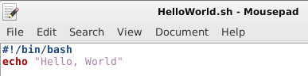

# Planning

Good morning! 
Here is what you will do today:

**Important**: post the answers within the self-study in the script review center!

Time  | Activity
------------- | -------------
Morning       |  Self-study: go through the following tutorial, and get confortable with a Linux environment and the terminal
13:30 to 15:30  | Presentation by Erik van Schaik (Working in the cloud!)
Rest of the afternoon | Do and finalise the exercise

# Today's Learning objectives

- Knowing what Linux is & what you can do with it 
- Getting comfortable working within a Linux environment
- Knowing how to use the *terminal*
    - Running R and Python from the terminal
- Learn the basics of *Bash* scripting and know how to create a shell script

# Linux?!

*Linux* is a free and open-source operating system kernel. In this course we will be working with *Ubuntu*, which is the most popular *Linux distribution*. A Linux distribution is an operating system that is built upon the Linux kernel and includes plenty of handy programs for daily work.

There is a large variety of different Linux distributions. One that is handy for geo-information science work is OSGeo-Live, which is an Ubuntu-based distribution that has a wide range of free and open-source GIS and Remote sensing tools preinstalled.
See [this website](http://live.osgeo.org/) for more information.

These tools are also available in other distributions, but they have to be installed manually. A general-use distribution such as *Ubuntu* or *openSUSE* is more suitable for regular day-to-day tasks, since not having the unnecessary tools installed takes less space and makes it work faster. It is also easier to find help for them than for specialised distributions. So in this course we will use a customised Ubuntu distribution with only the tools needed for this course preinstalled.

## Why use a Linux distribution?

A Linux environment makes it much easier to install and combine a variety of open-source software, such as Python modules and GDAL, compared to other operating systems like Windows or macOS. In addition, open-source scientific software is often developed primarily for Linux (since that's what most supercomputers and servers run!), and so it tends to be more stable and have more features on Linux. Furthermore, at Wageningen University & Research PC labs, ArcGIS and ArcPy are installed on the Windows machines, and this Python version tends to cause conflicts with open-source Python modules and tools (e.g. GDAL, GEOS).

## Getting started on Linux

During the course we will make use of a Linux virtual machine. There are two varieties of virtual machines available for this course: cloud VMs hosted by the [SURFsara High Performance Computing cloud](https://userinfo.surfsara.nl/systems/hpc-cloud) and accessed over the internet, and local VMs installed on the PCs in the PC lab. Either can be used, although most testing has been done on the cloud VMs.

First of all, you will need to set up either of the two.

### SURFsara cloud VM setup

[See this page for instructions on setting up the SURFsara cloud VMs](surfsara_tutorial.html).

### VirtualBox VM setup

[See this page for general instructions on setting up OSGeo-Live on VirtualBox](https://live.osgeo.org/en/quickstart/virtualization_quickstart.html). **Note**: There are cusom VM files provided so you don't have to download them from the internet (the files are quite large). You also do not need to add yourself to the `vboxsf` group (this is already taken care of). In the options, you might want to enable clipboard support (*Both*) so you can copy-paste between Windows and Linux.

Once you have everything ready, login into your Linux VM, try out RStudio/RKWard, and also open QGIS.

# Using the terminal and command line

*Why use the terminal?*: Under Linux there are GUIs (graphical user interfaces), where you can point and click and drag, and hopefully get work done without first reading lots of documentation. The traditional Unix environment is a CLI (command line interface), where you type commands to tell the computer what to do. That is *faster and more powerful*, but requires finding out what the commands are ([more information about using the terminal](https://help.ubuntu.com/community/UsingTheTerminal)).

There are many distributions of Linux (e.g. Ubuntu, CentOS, RedHat, SUSE, etc.), but almost all of them use similar commands that can be entered from a command-line interface terminal.

There are also many graphical user interfaces (GUIs), but each of them works differently and there is little standardization between them. Experienced users who work with many different Linux distributions therefore find it easier to learn commands that can be used in all varieties of Ubuntu and, indeed, in other Linux distributions as well.

**Question**: What are the advantages of using the terminal? Can you think of some examples?

## What is Bash?

**Bash**, the **Bourne-again-shell** (named after the author Stephen Bourne), scripting is one of the easiest types of scripting to learn, and is best compared to Windows [batch scripting](https://en.wikipedia.org/wiki/Batch_file). *Bash* is very flexible, and has many advanced features that you won't see in batch scripts.

However if you are a 'non-computer-savvy' person this won't mean a thing to you. Bash is the language that you will learn to love as much of everyday Linux life is done/can be done using the Terminal. You will soon learn that most things can be done through both GUI (Graphical User Interface) and CLI (Command Line Interface), however some things are more easily achieved from one or the other. For example, changing file permissions of specific type of files in a given directory is more easily achieved using CLI instead of GUI.

*Bash* is the default shell on Linux and Mac OS X. *Bash* shell scripting, like also *R* or *Python*, allows multiple commands to be combined, facilitating automation.

A shell script (shell program) is a text file that contains commands that are interpreted by the shell (see below, we will learn how to write a shell script).

Each command can be linked in a script to combine several commands by providing the output of one as input to the other. Shell scripts can also contain the control structures common to the majority of programming languages (i.e. variables, logic constructs, looping constructs, functions and comments). The main distinction between shell programs and those written in C, C++, Java (to name but a few) is that shell programs are not compiled for execution, but are readily interpreted by the shell.

**Question**: What is a shell script?

## Launching the Shell: terminal!

Is not a "Terminator" but something really powerful, because via the terminal you get access to the CLI and its default *Bash* shell. The terminal is an interactive command line program tat allows running the *Bash* interpreter, and is included in every Linux distribution as well as macOS and can also be installed on Windows. In fact, you have already used it to connect to the cloud VM: that's what the *Git Bash* program is! It is included with Git for Windows, and in Windows 10 *Bash* is even included by default with the [*Windows Subsystem for Linux*](https://msdn.microsoft.com/en-us/commandline/wsl/about). **It is important as a geo-scripter to know about the Terminal as if will offer a lot of advantages**. The more you'll get into scripting the more you will encounter the words "terminal", "shell", "bash", etc.

## Some commands

We will discuss useful everyday commands, as well as going a bit more in depth into scripting and semi-advanced features of Bash. Bash is not only used to run programs and applications, but it can also be used to write programs or scripts.

Launch the terminal by clicking on *Applications* → *Terminal Emulator*. This will look like:


Typing `man man` in the **terminal** will bring up the manual entry for the man command, which is a good place to start!

Manual pages are text files displayed in a pager program that allows easy scrolling. The default pager is `less`, which allows you to scroll using arrow keys, search with the `/` key and quit with the `q` key. You can also see its help by using the `h` key or looking at its manual page using `man less`.

`man intro` is especially useful - it displays the "Introduction to user commands" which is a well-written, fairly brief introduction to the Linux command line.

```bash
man intro
```

Most common commands:

- `pwd`: show your current working directory
- `cd`: change directory
- `cd ..`: move up one directory
- `mkdir`: create directory
- `rm` or `rm -R`: delete files or directories
- `sudo`: running programs as root (administrator/super-user), which may ask for your user pasword
- `ls`: listing files in a directory
- `cp`: copy files e.g. for backing up things or just copying. We will use these command in the scripts below.


**Note**: Bash has a feature called Tab-completion. If you start writing a command or filename, pressing the `Tab` key a couple of times will give a list of suggestions for auto-completion. This is super-handy so that you never need to write filenames etc. In addition, you can recall the last commands you entered by using the up arrow key. Lastly, you can always open multiple terminals, even in tabs, by using *File* → *Open Tab*.

Now type the following to bring you back to your home directory, and check what your current working directory is.

```bash
cd
pwd
```

This should looks as follows:


**Question**: What is the difference between `ls -l` and `ls -lh`?

Now, create a directory called `Bash` (i.e. a directory that will contain our *Bash* scripts)

```bash
mkdir Bash
```

It should now look like this:


Now, try out some more commands:
- make a directory and remove it (e.g. `mkdir namedirectory`, `rmdir namedirectory`).
- create an *R* script via *RStudio* or *RKWard*, and then remove it via the terminal using `rm filename.R`.
- create another file and copy it and then remove it, etc.:

```bash
cp source_file dest_file
rm dest_file
```

- use `ls` commands and its options.

Read the `File & Directory Commands` section (https://help.ubuntu.com/community/UsingTheTerminal) and let us know if you have questions about some commands. 

## Starting R or Python from the terminal

Starting and stopping R from the terminal (this is the same as the R console you know from *RStudio*/*RKWard*):
```{r, engine='bash', eval=FALSE}
R ## just type R and then q() to exit
q()
```


Starting and stopping *Python* from the terminal:

```
python
exit()
```

## Scripting in the terminal

### Hello, world Bash script 
*Bash* is primarily a scripting language, so it would be a crime not to talk about scripting. Let's dive straight in with a *Bash* script. More precisely the infamous "Hello World" script. You can create a bash script by opening your favorite text editor to edit your script and then saving it (typically the `.sh` file extension is used for your reference, but is not required. In our example, we will be using the `.sh` extension).

So let's get started. First, go to the `Bash` directory you just created. Within this directory create a simple text file and call it `HelloWorld.sh`, then add the following text and save. You can use the *Mousepad* editor, or use *RStudio* or *RKWard* as a sort of text editor. In fact, there are even command-line text editors, like `nano`.



```bash
#!/bin/bash
echo "Hello, World"

```

The first line of the script just defines which interpreter to use (and where it is located). NOTE: There is no leading whitespace before #!/bin/bash. That's it, simple as that! To find out where your `bash` interpreter is located type the following in the terminal (this works also on a Mac terminal!):

```bash
which bash
```

Second, to run a bash script you first have to have the correct file permissions. We do this with `chmod` (change mode) command in terminal as follows:

```bash
chmod u+x Bash/HelloWorld.sh  # Gives your user execute permissions
```

More info about `chmod` (https://help.ubuntu.com/community/FilePermissions) for your future reference. Note: today is just an introduction to let you know what is possible so that you can find your way easier in the future.

Below is a summary of what we have done in the terminal:

```{r, eval=FALSE, engine='bash'}
echo "Go to the Bash folder"
cd Bash
echo "Check that the file is there using the ls command:"
ls
echo "Then change the permissions:"
chmod u+x HelloWorld.sh
echo "We can now run our first Bash script:"
./HelloWorld.sh
```

Hopefully you should have seen it print `Hello, World` onto your screen. If so well done! That is your first *Bash* script (see below for a screenshot):


**Question**: Why do we add `./` in front of the Bash script?

**Note**: we can also access the Terminal from R using the `system()` function that can invoke an OS command:

```{r, echo=TRUE, message=TRUE}
## R code
setwd("Bash/") # Set the working directory in R
print(system("./HelloWorld.sh", intern = TRUE)) # Execute this command in Bash
```

### Bash script with a variable

Variables basically store information. You set variables like this (you can type this in the terminal). 

```bash
var="FOO"
```

`var` can be anything you want as long as it doesn't begin with a number. "FOO" can be anything you want. To access the information from the variable you need to put a '$' in front of it like this:

```bash
echo $var
```

Now create the following e.g. `variables.sh` script in the *Bash* folder and apply the `chmod u+x variables.sh` command on this script using the terminal.

```bash
#!/bin/bash
echo "Now with the read function"
clear
echo "Please enter your name"
read name
echo "Please enter your age"
read age
echo "Please enter your sex. Male/Female"
read sex
echo "So you're a $age year old $sex called $name"
```

You can run the script once it is *executable*:
```{r, engine='bash', eval=FALSE}
./variables.sh
```

**Question**: Try it out yourself, and try to do a calculation of e.g. a + b as input variables. Hint: [Shell-tips](https://www.shell-tips.com/2010/06/14/performing-math-calculation-in-bash/)

If you want to learn more about *Bash* scripting: https://help.ubuntu.com/community/Beginners/BashScripting

## Using the GDAL library from the terminal

We will learn more about GDAL in the later lessons. GDAL is a very powerful and fast processing library written in C/C++ for raster and vector geospatial data formats. Now via the terminal we can access GDAL directly! E.g. we can check out what the current version of GDAL is that is installed on our Linux OS.

Let's download a file from [The intro to raster lesson](https://geoscripting-wur.github.io/IntroToRaster/#raster-objects-manipulations):
Download the `gewata.zip` file from Github ([link](https://github.com/GeoScripting-WUR/IntroToRaster/raw/gh-pages/data/gewata.zip)) and unzip in the `data` directory. Type the following in the `data` directory: (Note: You can write a shell script to do the following commands below but first type in the commands via the terminal to understand what is happening.)

```{r, eval = TRUE, engine='bash'}
echo "the current GDAL version is:"
gdal-config --version
```

One of the easiest and most useful commands in GDAL is `gdalinfo`. When given an image as an argument, it retrieves and prints all relevant information that is known about the file. This is especially useful if the image contains additional tag data, as is the case with `TIF` files.

Using gdalinfo:

```{r, eval = TRUE, engine='bash', eval=FALSE}
cd data
ls *.tif
gdalinfo -nomd -norat -noct LE71700552001036SGS00_SR_Gewata_INT1U.tif
```

Now let's calculate the NDVI via GDAL terminal by using the `gdal_calc.py`. See [GDAL_calc](http://www.gdal.org/gdal_calc.html) for more information.


```{r, engine='bash', eval=TRUE}
cd data
cp LE71700552001036SGS00_SR_Gewata_INT1U.tif input.tif
echo "* all files in the directory"
ls
echo "* now apply gdal_calc: Command line raster calculator with numpy syntax"
gdal_calc.py -A input.tif --A_band=4 -B input.tif --B_band=3  --outfile=ndvi.tif  --calc="(A.astype(float)-B)/(A.astype(float)+B)" --type='Float32'
echo "* remove the input temporary file"
rm input.tif
```

**Question**: Try to write to calculate the NDVI using the lines above in a nice and short shell script.
- Hint 1: `cd ../data` (to move back from the Bash folder and move into the data folder)
- Hint 2: No spaces in file names are allowed and try to use variables e.g. `fn=$(ls *.tif)`


Let's now check if the range of the NDVI values makes sense, and make a nice script:
```{r, engine='bash', results='hide', eval =FALSE}
#!/bin/bash
echo "teamname"
echo "14 January 2016"
echo "Calculate LandSat NDVI"
cd ../data
fn=$(ls *.tif)
echo "The input file: $fn"
outfn="ndvi.tif"
echo "The output file: $outfn"
echo "calculate ndvi"
gdal_calc.py -A $fn --A_band=4 -B $fn --B_band=3 --outfile=$outfn --calc="(A.astype(float)-B)/(A.astype(float)+B)" --type='Float32'
echo "look at some histogram statistics"
gdalinfo -hist -stats $outfn
```

More info here on the power of GDAL via the terminal:
http://www.gdal.org/ and `gdalinfo`

Handy functions are (See the examples at the bottom):

- `gdal_translate`: http://www.gdal.org/gdal_translate.html
- `gdalwarp`: http://www.gdal.org/gdalwarp.html

More info about *Bash* basics: https://www.gnu.org/software/bash/manual/bashref.html#Command-Substitution

Optional: if you are ready and want the learn more about using GDAL from the terminal. See here for another tutorial:
http://wiki.americaview.org/display/miview/Introduction+to+GDAL

## Excercise
Let's download a file from [The intro to raster lesson](https://geoscripting-wur.github.io/IntroToRaster/#raster-objects-manipulations).
Download the `gewata.zip` file from Github ([link](https://github.com/GeoScripting-WUR/IntroToRaster/raw/gh-pages/data/gewata.zip)) and unzip in the data directory.

Write a shell script that:

- derives NDVI from the landsat `*.tif` file as `NDVI.tif`
- resamples the NDVI tif file to pixels of 60 m
- *Bonus*: reprojects this resampled file to Lat/long WGS84 (the projection code is: EPSG:4326)
    - Tip: `gdalwarp -t_srs EPSG:4326 $fntemp $fnout`

Submit the text of your shell script via Blackboard in the "Script Review Center" before tomorrow (9:30).
Make sure your script is clear and reproducible, and let it be tested by at least one other team. 
You can copy the code in the BlackBoard review center (the other team needs to make it excecutable in order to test it).

*Do not forget to add a teamname, and members and date of script at the top of your script.*

[More tips](http://www.geos.ed.ac.uk/~smudd/TopoTutorials/html/tutorial_raster_conversion.html)

## More information

- [Hands-on introduction to bash basics for beginners](https://news.opensuse.org/2014/06/10/command-line-tuesdays-part-one/)
- A great bash scripting tutorial: http://linuxconfig.org/bash-scripting-tutorial
- [An overview of terminal commands](http://beginlinux.com/twitter/1094-the-beginners-guide-to-the-ubuntu-terminal)
- http://www.howtogeek.com/140679/beginner-geek-how-to-start-using-the-linux-terminal/
- http://www.howtogeek.com/howto/42980/the-beginners-guide-to-nano-the-linux-command-line-text-editor/
- http://linuxcommand.org/lc3_learning_the_shell.php
- http://www.cyberciti.biz/faq/pwd-linux-unix-command-examples/
- For macOS users and introduction to use the terminal on macOS
    - http://computers.tutsplus.com/tutorials/navigating-the-terminal-a-gentle-introduction--mac-3855
    - http://blog.teamtreehouse.com/introduction-to-the-mac-os-x-command-line
    - [Is the terminal in Mac and Linux the same](https://stackoverflow.com/questions/8051145/is-the-terminal-in-mac-and-linux-the-same)
- [Python code Building plug-in](https://www.youtube.com/watch?v=eWNEcJYnkPQ)
- [Using Jupyter notebook within OSGEO](http://www.r-bloggers.com/interactive-r-notebooks-with-jupyter-and-sagemathcloud/)
