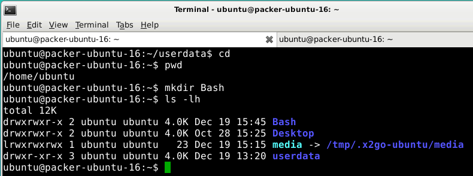

# Planning

Good morning! 
Here is what you will do today:

Time  | Activity
------------- | -------------
Morning  |  Self-study: go through the following tutorial, and get confortable with OSGEO-live and the linux terminal
1330 to 1530  | Presentation by Allard de Wit (linux), demo session by Erik van Schaik (Github education and Amazon AWS)

Rest of the afternoon | Do and finalise the exercise

# Today's Learning objectives

- Knowing what Linux is & what you can do with it 
- Getting comfortable within OSGEO-Linux environment
    - running R and Python from the Linux terminal
- Knowing how to use the **terminal**
- Learn the basics of `Bash` scripting and know how to create a shell script

# OSGEO-live?!

OSGEO-live is a linux operating system (i.e. Lubuntu) with a wide range of free and open-source GIS and Remote sensing tools installed.
See this website (http://live.osgeo.org/) for more information. We will use OSGEO-live via VMware workstation player (see [here](https://geoscripting-wur.github.io/system_setup/) for instructions and we will also explain this in the lesson on Tuesday afternoon).

## Why Linux & OSGEO-live?

We are using OS-GEO-live here, especially since installing open-source tools and python modules is so much more easy on Linux than it is on for example another operating system like Windows or Mac. Furthermore, at WU there is also ArcGIS and Arcpy installed on the windows machines and this python version tends to cause conflits with open-source python modules and tools (e.g. GDAL, GEOS).

## Getting started on OSGEO-live

First open your computer, VMware workstation Player (as demonstrated in yesterdays lesson).

Second, login into your linux, try out Rstudio, and also open QGIS.

 Third, follow this overview presentation of what is possible within OSGEO-live: http://live.osgeo.org/en/presentation/index.html#/

**Question**: After browsing through the presentation you now have a better idea of what is available via this OS-GEO live Operating system. Now, can you explain what: 
    
    - OS-GEO live is?
    - What we can do with GDAL and GEOS (hint: see presentation?)?

# Using the terminal and command line

*Why using the terminal?*: Under Linux there are GUIs (graphical user interfaces), where you can point and click and drag, and hopefully get work done without first reading lots of documentation. The traditional Unix environment is a CLI (command line interface), where you type commands to tell the computer what to do. That is *faster and more powerful*, but requires finding out what the commands are ([more information about using the terminal](https://help.ubuntu.com/community/UsingTheTerminal)).

There are many varieties of Linux (e.g. Ubuntu, Centos, RedHat, etc.), but almost all of them use similar commands that can be entered from a command-line interface terminal.

There are also many graphical user interfaces (GUIs), but each of them works differently and there is little standardization between them. Experienced users who work with many different Linux distributions therefore find it easier to learn commands that can be used in all varieties of Ubuntu and, indeed, in other Linux distributions as well.

**Question**: 

    - What are the advantages of using the terminal? Can you think of some examples?

## What is Bash?

`Bash`, the **Bourne-again-shell** (named after the author Stephen Bourne), scripting is one of the easiest types of scripting to learn, and is best compared to Windows `Batch` scripting via [DOS](http://en.wikipedia.org/wiki/DOS). `Bash` is very flexible, and has many advanced features that you won't see in batch scripts.

However if you are a 'non-computer-savvy' person this won't mean a thing to you. Bash is the language that you will learn to love as much of everyday Linux life is done/can be done using the Terminal. You will soon learn that most things can be done through both GUI (Graphical User Interface) and CLI (Command Line Interface), however some things are more easily achieved from one or the other. For example, changing file permissions of a folder and all its sub folders is more easily achieved using cli instead of gui.

Bash, is the default shell on Linux and Mac OS X. Bash shell scripting, like also `R` or `Python`, allows multiple commands to be combined, facilitating automation.

A shell script (shell program) is a text file that contains commands that are interpreted by the shell (see below, we will learn how to write a shell script).

Each command can be linked in a script to combine several commands by providing the output of one as input to the other. Shell scripts can also contain the control structures common to the majority of programming languages (i.e. variables, logic constructs, looping constructs, functions and comments). The main distinction between shell programs and those written in C, C++, Java (to name but a few) is that shell programs are not compiled for execution, but are readily interpreted by the shell.

**Question** : 

    - What is a shell script?

## Launching the Shell: terminal!

Is not a "Terminator" but something really powerful because via the terminal you get access to the CLI and its default Bash interface. The terminal is the engine behind linux and mac and can also be installed on Windows via a program called [Cygwin](https://www.cygwin.com) which provide a Linux interface on Windows. **It is important as a geo-scripter to know about the Terminal as if will offer a lot of advantages**. The more you'll get into scripting the more you will encounter the words "terminal", "shell", "bash", etc.

## Some commands

We will discuss useful everyday commands, as well as going a bit more in depth into scripting and semi-advanced features of Bash. Bash is not only used to run programs and applications, but it can also be used to write programs or scripts.

Now, within OSGEO-live you can use the **keyboard Shortcut**: `Ctrl + Alt + T`, to launch the terminal. This will look like:


Typing "man man" in the **terminal** will bring up the manual entry for the man command, which is a good place to start! You can launch the terminal via: 

```{r, eval=FALSE}
man man
## scroll down to examples
## type 'q' to exit
```

"man intro" is especially useful - it displays the "Introduction to user commands" which is a well-written, fairly brief introduction to the Linux command line.

```{r, eval=FALSE}
man intro
```

Most common commands:

- `pwd`: checking your current working directory
- `cd`: change directory
- `cd ..`: move up one directory
- `mkdir`: creating folders
- `rm` or `rm -R`: deleting files or folders
- `sudo`: opening applications as root (super-user, `su`) which requires your `su` pasword
- `ls`: listing files in a folder
- `cp`: copy files e.g. for backing up things or just copying. We will use these command it the scripts below.


Note!: Tab completion works from the terminal which is super-handy so that you never need to write filenames etc.

Now type to bring you back to your home folder, and chech what your current working directory is.

```{r, eval=FALSE}
cd
pwd
```

This should looks as follows:


*Question*: What is the difference between `ls -l` and `ls -lh`?

Now, create the `Bash` folder (i.e. a folder that will contain our Bash Scripts)

```{r, eval=FALSE}
mkdir Bash
```

It should now look like this:




Now, try out some more commands:
- make a directory and remove it (e.g. `mkdir -R namedirectory).
- create an Rscript via Rstudio, and then remove it via the terminal using `rm filename.R`.
- create another file and copy it and then remove it, etc.:

```{r, eval=FALSE}
cp source_file dest_file
rm dest_file
```

- use `ls` commands and its options.

Read the `File & Directory Commands` section (https://help.ubuntu.com/community/UsingTheTerminal) and let us know if you have questions about some commands. 

## Starting R or Python from the terminal

Starting and stopping R from the terminal (this will provide you the same within the `console` as in *Rstudio*:
```{r, engine='bash', eval=FALSE}
R ## just type R and then q() to exit
q()
```


Starting and stopping python from the terminal:

```{r, engine='bash', eval=FALSE}
python
exit()
```

## Scripting in the terminal

### Hello, world Bash script 
`Bash` is primarily a scripting language, so it would be a crime not to talk about scripting. Let's dive straight in with a `bash` script. More precisely the infamous "Hello World" script. You can create a bash script by opening your favorite text editor to edit your script and then saving it (typically the `.sh` file extension is used for your reference, but is not necessary. In our example, we will be using the `.sh` extension).

So let's get started. First, go to the `Bash` folder you just created. 
Within this folder create a simple text file using *Rstudio -> New File -> Text File* and call this file: `HelloWorld.sh` add the following text and save.

```{r, eval=FALSE, engine='bash'}
 #!/bin/bash         
echo "Hello, World"
```

The first line of the script just defines which interpreter to use (and where it is located). NOTE: There is no leading whitespace before #!/bin/bash. That's it, simple as that!'. To find out where your `bash` interpreter is located type the following in the terminal (this works also on a Mac terminal!):

```{r, engine='bash', eval=FALSE}
which bash
```

Second, to run a bash script you first have to have the correct file permissions. We do this with `chmod` command in terminal (change mode) as follows:

```{r, eval=FALSE}
chmod a+x ~/Bash/HelloWorld.sh   #Gives everyone execute permissions
```

More info about `chmod` (https://help.ubuntu.com/community/FilePermissions) for your future reference. Note: today is just an introduction to let you know what is possible so that you can find your way easier in the future.

**Insert figure###

Below is a summary of what we have done in the terminal:

```{r, eval=FALSE, engine='bash'}
echo "Go to the Bash folder"
cd Bash
echo "Check that the file is there using the ls command:"
ls
echo "Then change the permissions:"
chmod a+x HelloWorld.sh
echo "We can now run our first `Bash script`:"
./HelloWorld.sh
```

Hopefully you should have seen it print Hello, World!!! onto your screen. If so well done! That is your first `Bash` script (see below for a screenshot):


**Question**: 

    - Why do we add `./` in front of the Bash script?

Note!: we can also access the Terminal from R using the `system()` function that can invoke a OS command:

```{r, echo=TRUE, message=TRUE}
## R code
setwd("Bash/") ## set the working director in R
print(system("./HelloWorld.sh", intern = TRUE)) ## set this command to the Terminal
```

### Bash script with a variable

Variables basically store information. You set variables like this (you can type this in the terminal). 

```{r, eval=FALSE}
var="FOO"
```

`var` can be anything you want as long as it doesn't begin with a number. "FOO" can be anything you want. To access the information from the variable you need to put a '$' in front of it like this:

```{r, eval=FALSE}
echo $var
```

Now create the following e.g. `variables.sh` script in the *Bash* folder and apply the `chmod a+x variables.sh` command on this script using the terminal.

```{r, engine='bash', eval=FALSE}
#!/bin/bash
echo "Now with the read function"
clear
echo "Please enter your name"
read name
echo "Please enter your age"
read age
echo "Please enter your sex. Male/Female"
read sex
echo "So you're a $age year old $sex called $name"
```

You can run the script once it is *executable*:
```{r, engine='bash', eval=FALSE}
./variables.sh
```

** Question **:

    - Try it out yourself, and try to do a calculation of e.g. a + b as input variables  
    
Hint: [Shell-tips](https://www.shell-tips.com/2010/06/14/performing-math-calculation-in-bash/)

If you want to learn more about `Bash` scripting: https://help.ubuntu.com/community/Beginners/BashScripting

## Using the GDAL library from the terminal

We will learn more about GDAL in the later lessons. GDAL is a very powerful translator library written in C/C++ for raster and vector geospatial data formats.
Now via the terminal we can access GDAL directly!!! E.g. we can check out what the current version of GDAL is that is installed on our Linux OS:

Let's download a file from [The intro to raster lesson](https://geoscripting-wur.github.io/IntroToRaster/#raster-objects-manipulations):
Download the `gewata.zip` file from Github ([link](https://github.com/GeoScripting-WUR/IntroToRaster/raw/gh-pages/data/gewata.zip)) and unzip in the data folder. Type the following in the data folder:

You can write a shell script to do the following commands below but first type in the commands via the terminal to understand what is happening:

```{r, eval = TRUE, engine='bash'}
echo "the current GDAL version is:"
gdal-config --version
```

One of the easiest and most useful commands in GDAL is `gdalinfo`. When given an image as an argument, it retrieves and prints all relevant information that is known about the file. This is especially useful if the image contains additional tag data, as is the case with `TIF` files.

Using gdalinfo:

```{r, eval = TRUE, engine='bash'}
cd data
ls *.tif
gdalinfo -nomd -norat -noct LE71700552001036SGS00_SR_Gewata_INT1U.tif
```

Now let's calculate the NDVI via GDAL terminal by using the `gdal_calc.py`. For more information about [GDAL_calc](http://www.gdal.org/gdal_calc.html).


```{r, engine='bash', eval=TRUE}
cd data
cp LE71700552001036SGS00_SR_Gewata_INT1U.tif input.tif
echo "* all files in the directory"
ls
echo "* now apply gdal_calc: Command line raster calculator with numpy syntax"
gdal_calc.py -A input.tif --A_band=4 -B input.tif --B_band=3  --outfile=ndvi.tif  --calc="(A.astype(float)-B)/(A.astype(float)+B)" --type='Float32'
echo "* remove the input temporary file"
rm input.tif
```

Challenge:

- try to write to calculate the NDVI using the lines above in a nice and short shell script.
- Hint 1: `cd ../data` (to move back from the Bash folder and move into the data folder)
- Hint 2: No spaces are allowed and e.g. try to use `fn=$(ls *.tif)`

Let's now check if the range of the NDVI values makes sense:
```{r, engine='bash', results='hide', eval =FALSE}
## set to false
cd data
echo "* list all files"
ls -lht
echo "* histogram statistics"
gdalinfo -hist -stats ndvi.tif
```

More info here on the power of GDAL via the terminal:
http://www.gdal.org/ and `gdalinfo`

Handy functions are (See the examples at the bottom):

- `gdal_translate`: http://www.gdal.org/gdal_translate.html
- `gdalwarp`: http://www.gdal.org/gdalwarp.html

More info about `Bash` basics: https://www.gnu.org/software/bash/manual/bashref.html#Command-Substitution

Optional: if you are ready and want the learn more about using GDAL from the terminal. See here for another tutorial:
http://wiki.americaview.org/display/miview/Introduction+to+GDAL

## Excercise
Let's download a file from [The intro to raster lesson](https://geoscripting-wur.github.io/IntroToRaster/#raster-objects-manipulations).
Download the `gewata.zip` file from Github ([link](https://github.com/GeoScripting-WUR/IntroToRaster/raw/gh-pages/data/gewata.zip)) and unzip in the data folder.

Write a shell script that:

 - derives NDVI from the landsat *.tif file as NDVI.tif
 - resampels the NDVI tif file to pixels of 60 m
 - *Bonus*: reprojects this resampled file to Lat/long WGS84 (the projection code is: EPSG:4326)
 
    - Tip!!!: `gdalwarp -t_srs EPSG:4326 $fntemp $fnout`

Submit the text of your shell script via Blackboard in the "Script Review Center" before tomorrow (930u).
Make sure your script is clear and reproducible, and let is test by at least one other team. 
You can upload your shell script as attachment or you can also copy the code in the BlackBoard reply zone (the other team needs to make it excecutable in order to test it.

*Do not forget to add a teamname, and members and date of script at the top of your script.*

[More tips](http://www.geos.ed.ac.uk/~smudd/TopoTutorials/html/tutorial_raster_conversion.html)

## More information

- A great bash scripting tutorial: http://linuxconfig.org/bash-scripting-tutorial
- [An overview of terminal commands](http://beginlinux.com/twitter/1094-the-beginners-guide-to-the-ubuntu-terminal)
- http://www.howtogeek.com/140679/beginner-geek-how-to-start-using-the-linux-terminal/
- http://www.howtogeek.com/howto/42980/the-beginners-guide-to-nano-the-linux-command-line-text-editor/
- http://linuxcommand.org/lc3_learning_the_shell.php
- http://www.cyberciti.biz/faq/pwd-linux-unix-command-examples/
- For Mac users and tntroduction to use the terminal on Mac
    - http://computers.tutsplus.com/tutorials/navigating-the-terminal-a-gentle-introduction--mac-3855
    - http://blog.teamtreehouse.com/introduction-to-the-mac-os-x-command-line
    - [Is the terminal in Mac and Linux the same](https://stackoverflow.com/questions/8051145/is-the-terminal-in-mac-and-linux-the-same)
- [Python code Building plug-in](https://www.google.nl/url?sa=t&rct=j&q=&esrc=s&source=web&cd=6&cad=rja&uact=8&ved=0ahUKEwjuyp3np_LJAhXEHg8KHT1sDbwQtwIIRjAF&url=https%3A%2F%2Fwww.youtube.com%2Fwatch%3Fv%3DeWNEcJYnkPQ&usg=AFQjCNFl3yb7yw3mf2arEc38_flIkdZWxA&sig2=u1GrY051UiDyeVg5JyfJXw)
- [Using Jupyter notebook within OSGEO](http://www.r-bloggers.com/interactive-r-notebooks-with-jupyter-and-sagemathcloud/)
