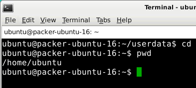

# Planning

Good morning! 
Here is what you will do today:

Time  | Activity
------------- | -------------
Morning       |  Self-study: go through the following tutorial, and get confortable with a Linux environment and the terminal
13:30 to 15:30  | Discussion
Rest of the afternoon | Do and finalise the exercise

# Today's Learning objectives

- Knowing what Linux is & what you can do with it 
- Getting comfortable working within a Linux environment
- Knowing how to use the *terminal*
    - Running R and Python from the terminal
- Learn the basics of *Bash* scripting and know how to create a shell script

# Linux?!

*Linux* is a free and open-source operating system kernel. In this course we will be working with *Ubuntu*, which is the most popular *Linux distribution*. A Linux distribution is an operating system that is built upon the Linux kernel and includes plenty of handy programs for daily work.

There is a large variety of different Linux distributions. One that is handy for geo-information science work is OSGeo-Live, which is an Ubuntu-based distribution that has a wide range of free and open-source GIS and Remote sensing tools preinstalled.
See [this website](http://live.osgeo.org/) for more information.

These tools are also available in other distributions, but they have to be installed manually. A general-use distribution such as *Ubuntu* or *openSUSE* is more suitable for regular day-to-day tasks, since not having the unnecessary tools installed takes less space and makes it work faster. It is also easier to find help for them than for specialised distributions. So in this course we will use a customised Ubuntu distribution with only the tools needed for this course preinstalled.

## Why use a Linux distribution?

A Linux environment makes it much easier to install and combine a variety of open-source software, such as Python modules and GDAL, compared to other operating systems like Windows or macOS. In addition, open-source scientific software is often developed primarily for Linux (since that's what most supercomputers and servers run!), and so it tends to be more stable and have more features on Linux. Furthermore, at Wageningen University & Research PC labs, ArcGIS and ArcPy are installed on the Windows machines, and this Python version tends to cause conflicts with open-source Python modules and tools (e.g. GDAL, GEOS).

## Getting started on Linux

During the course we will make use of a Linux virtual machine. There are two varieties of virtual machines available for this course: cloud VMs hosted by the [SURFsara High Performance Computing cloud](https://userinfo.surfsara.nl/systems/hpc-cloud) and accessed over the internet, and local VMs installed on the PCs in the PC lab. Either can be used, although most testing has been done on the cloud VMs. Also note that the cloud VMs will not be available on Tuesday 24 January 2017, so it is best if you try out both solutions (as time permits).

First of all, you will need to set them up.

### SURFsara cloud VM setup

[See this page for instructions on setting up the SURFsara cloud VMs](surfsara_tutorial.html).

### VirtualBox VM setup

To set up VirtualBox, first find the provided image of OSGeo-Live on the network drive in the PC lab, which should be available to you as `W:\Student\Shares\GRS51806\2017\osgeo-live.ova`. This is a compressed VirtualBox image with RStudio installed. For use on your own PCs, you can copy the file on your PC from the PC lab or download OSGeo-Live from [its website](https://live.osgeo.org/en/quickstart/virtualization_quickstart.html).

Once you have the file, all you need to do is import it in VirtualBox by going to *File → Import Appliance* and specifying the location of the OVA file. Everything else can be left default.

Once importing is complete, you can go to the appliance settings and set the M: shared folder to be read-write by deselecting *Read-only* in its properties (*Shared folders* tab). That way all files you have in the shared folder will also be visible from the VM. You can see it by running the VM, opening the file manager in it and clicking on the *sf_M_DRIVE* mount on the left side of the window.

Once you have everything ready, login into your Linux VM, try out RStudio/RKWard, and also open QGIS.

# Using the terminal and *Bash*

There are two ways to interact with your operating system: a graphical user interface (GUI), where you point and click, and a command-line interface (CLI), where you type commands to make something happen. GUIs are simpler to use, but CLIs are more powerful and faster for some tasks, once you get used to them.

> **Question 1**: What are the advantages of using CLI? Can you think of some examples?

Most Linux distributions come with a *terminal*, which is a program you use to run CLI programs. You might know the *Command Prompt* program on Windows: that is a type of *terminal*. On Linux, there is a variety of terminal applications to choose from. You can start one on your virtual machine by clicking on *Applications* → *Terminal Emulator*. This will look like:


A *terminal* is just a gateway to the world of CLIs, but through it you interact with a particular *shell* (or *command interpreter*) which speaks a programming language. The default shell on Linux is *Bash*, and programs written in the *Bash* language are called *Bash scripts*. Much like the *R* console, you can input commands to *Bash* line by line through the *terminal*.

*Bash* shell scripting, like also *R* or *Python*, allows multiple commands to be combined, facilitating automation. A shell script (shell program) is a text file that contains commands that are interpreted by the shell (see below, we will learn how to write a shell script). Each command can be linked in a script to combine several commands by providing the output of one as input to the other. Shell scripts can also contain the control structures common to the majority of programming languages (i.e. variables, logic constructs, looping constructs, functions and comments). The main distinction between shell programs and those written in C, C++, Java (to name but a few) is that shell programs are not compiled for execution, but are readily interpreted by the shell.

> **Question 2**: What is a shell script?

*Bash* is not only the default shell on Linux, but also macOS, and there are versions of *Bash* that run on Windows too. It is included with Git for Windows, and in Windows 10 *Bash* is even included by default with the [*Windows Subsystem for Linux*](https://msdn.microsoft.com/en-us/commandline/wsl/about). However, without the wealth of CLI programs that Linux distributions come with, *Bash* functionality is fairly limited.

But enough theory: let's try using the terminal in practice! Go through this exercise and see what happens: [https://news.opensuse.org/2014/06/10/command-line-tuesdays-part-one/](https://news.opensuse.org/2014/06/10/command-line-tuesdays-part-one/)

## Basic commands

Now go through the next exercise to learn how to navigate the file system: [https://news.opensuse.org/2014/06/24/command-line-tuesdays-part-two/](https://news.opensuse.org/2014/06/24/command-line-tuesdays-part-two/)

The file system layout image might not display properly, but it is intended to show this:


Once you're done, you should have something like this displayed in your terminal:



Next, let's go into some useful every-day commands: [https://news.opensuse.org/2014/07/01/command-line-tuesdays-part-three/](https://news.opensuse.org/2014/07/01/command-line-tuesdays-part-three/)

> **Question 3**: What is the difference between `ls -l`, `ls -lh` and `ls -lh --si`?

## File manipulation

Now let's dive into manipulating files and directories: [https://news.opensuse.org/2014/07/08/command-line-tuesdays-part-four/](https://news.opensuse.org/2014/07/08/command-line-tuesdays-part-four/)

Now, create a directory called `Bash` (i.e. a directory that will contain our *Bash* scripts)

```{r, eval=FALSE, engine='bash'}
mkdir Bash
```

It should now look like this:


Now, try out some more commands:
- make a directory and remove it (e.g. `mkdir namedirectory`, `rmdir namedirectory`).
- create an *R* script via *RStudio* or *RKWard*, and then remove it via the terminal using `rm filename.R`.
- create another file and copy it and then remove it, etc.:

```{r, eval=FALSE, engine='bash'}
cp source_file dest_file
rm dest_file
```

- use `ls` commands and its options.

**Tip**: Bash has a feature called Tab-completion. If you start writing a command or filename, pressing the `Tab` key a couple of times will give a list of suggestions for auto-completion. This is super-handy so that you never need to write filenames etc. In addition, you can recall the last commands you entered by using the up arrow key. Lastly, you can always open multiple terminals, even in tabs, by using *File* → *Open Tab*.

## More information about commands

So far we have been using only a few of the functions that the commands offer. You can find a list of them by looking at their manual pages by following the last exercise: [https://news.opensuse.org/2014/07/15/command-line-tuesdays-part-five/](https://news.opensuse.org/2014/07/15/command-line-tuesdays-part-five/)

Manual pages are text files displayed in a pager program that allows easy scrolling. The default pager is `less`, which you have already used in the third exercise. You can also look at its manual page using `man less`. Also try `man intro`: the "Introduction to user commands", a well-written, fairly brief introduction to the Linux command line.

```{r, eval=FALSE, engine='bash'}
man intro
```

Here's a list of most common commands:

- `pwd`: show your current working directory
- `cd`: change directory
- `cd ..`: move up one directory
- `mkdir`: create directory
- `rm` or `rm -R`: delete files or directories
- `sudo`: running programs as root (administrator/super-user), which may ask for your user pasword
- `ls`: listing files in a directory
- `cp`: copy files e.g. for backing up things or just copying. We will use these command in the scripts below.


You can also read the [Ubuntu documentation on CLI](https://help.ubuntu.com/community/UsingTheTerminal) to learn more, and let us know if you have questions about some commands. 

## Package installation and management

One of the greatest advantages of Linux distributions over other OSs is the package manager. Even if you never used Linux before, you are probably already using a package manager on your mobile device: The App Store, Google Play Store and Windows Store are all package managers, modelled after the Linux ones. A package manager is a central system for downloading, installing and removing software.

Each major Linux distribution has its own package manager, which is aware of all packages maintained by the distribution. These packages are tested and are known to work with that particular distribution version, so the package manager is the first place to look for installing additional software. The package manager is typically a command-line program, although some distributions also have GUI interfaces for it.

Ubuntu uses *Aptitude* as the package manager. Here is a short list of the most useful package manager commands on Ubuntu:

- `apt search`: Search for a package
- `sudo apt-get install`: Install a package
- `sudo apt-get update`: Update one or more packages
- `sudo apt-get remove`: Uninstall a package
- See `man apt` for more.

For instance, if you run `apt search chrom`, one of the results will be `chromium-browser`. It's [Chromium](https://en.wikipedia.org/wiki/Chromium_(web_browser)), the open-source version of Google Chrome. You can install it by running `sudo apt-get install chromium-browser`. Similarly, the Ubuntu package repository contains a lot (but not all) of R packages (they are prefixed with `r-cran-`) and Python packages (prefixed with `python-`; the ones prefixed with `python3-` are for Python 3 which we will not be using this year). If there is a package available in the distribution repository, almost always it is better to use that instead of using a package manager built into the language (`install.packages` in R and `easyinstall`/`pip`/`conda` in Python).

The aforementioned commands are specific to Debian and its derivatives (Ubuntu is one). In other distributions, package manager syntax is different, but the result is the same. For instance, in openSUSE the equivalent commands would be `zypper search`, `sudo zypper install`, `sudo zypper update` and `sudo zypper remove`.

Whenever a package is not included in the distribution repository, one option is to look for additional software sources. Ubuntu allows users to maintain their own packages through a system called Personal Package Archives (PPA). However, these packages are not tested and are not guaranteed to work, or could even cause problems in the system, so you have to be careful. Other distributions also have their own third-party repository systems: openSUSE uses Open Build Service, Fedora uses Copr etc.

If a package doesn't exist in third party repositories either, there is often the possibility to download the source code of a package and compile it. Often times cross-platform software vendors provide installers for Windows and source code for Linux. However, compiling from source yourself should only be done as the very last resort; in fact, it is often easier and safer to create a package yourself than to try to build it from source!

## Starting R or Python from the terminal

Starting and stopping R from the terminal (this is the same as the R console you know from *RStudio*/*RKWard*):
```{r, engine='bash', eval=FALSE}
R ## just type R and then q() to exit
q()
```


Starting and stopping *Python* from the terminal:

```{r, eval=FALSE, engine='bash'}
python
exit()
```

## Scripting in the terminal

### Hello, world Bash script 
*Bash* is primarily a scripting language, so it would be a crime not to talk about scripting. Let's dive straight in with a *Bash* script. More precisely the infamous "Hello World" script. You can create a bash script by opening your favorite text editor to edit your script and then saving it (typically the `.sh` file extension is used for your reference, but is not required. In our example, we will be using the `.sh` extension).

So let's get started. First, go to the `Bash` directory you just created. Within this directory create a simple text file and call it `HelloWorld.sh`, then add the following text and save. You can use the *Mousepad* editor, or use *RStudio* or *RKWard* as a sort of text editor. In fact, there are even command-line text editors, like `nano`.


```{r, eval=FALSE, engine='bash'}
#!/bin/bash
echo "Hello, World"

```

The first line of the script just defines which interpreter to use (and where it is located). NOTE: There is no leading whitespace before #!/bin/bash. That's it, simple as that! To find out where your `bash` interpreter is located type the following in the terminal (this works also on a Mac terminal!):

```{r, eval=FALSE, engine='bash'}
which bash
```

Second, to run a bash script you first have to have the correct file permissions. We do this with `chmod` (change mode) command in terminal as follows:

```{r, eval=FALSE, engine='bash'}
chmod u+x Bash/HelloWorld.sh  # Gives your user execute permissions
```

More info about `chmod` (https://help.ubuntu.com/community/FilePermissions) for your future reference. Note: today is just an introduction to let you know what is possible so that you can find your way easier in the future.

Below is a summary of what we have done in the terminal:

```{r, eval=FALSE, engine='bash'}
echo "Go to the Bash folder"
cd Bash
echo "Check that the file is there using the ls command:"
ls
echo "Then change the permissions:"
chmod u+x HelloWorld.sh
echo "We can now run our first Bash script:"
./HelloWorld.sh
```

Hopefully you should have seen it print `Hello, World` onto your screen. If so well done! That is your first *Bash* script (see below for a screenshot):


> **Question 4**: Why do we add `./` in front of the Bash script?

**Note**: we can also access the Terminal from R using the `system()` function that can invoke an OS command:

```{r, echo=TRUE, message=TRUE}
## R code
setwd("Bash/") # Set the working directory in R
print(system("./HelloWorld.sh", intern = TRUE)) # Execute this command in Bash
```

### Bash script with a variable

Variables basically store information. You set variables like this (you can type this in the terminal). 

```{r, eval=FALSE, engine='bash'}
var="FOO"
```

`var` can be anything you want as long as it doesn't begin with a number. "FOO" can be anything you want. To access the information from the variable you need to put a '$' in front of it like this:

```{r, eval=FALSE, engine='bash'}
echo $var
```

Now create the following e.g. `variables.sh` script in the *Bash* folder and apply the `chmod u+x variables.sh` command on this script using the terminal.

```{r, eval=FALSE, engine='bash'}
#!/bin/bash
echo "Now with the read function"
clear
echo "Please enter your name"
read name
echo "Please enter your age"
read age
echo "Please enter your sex. Male/Female"
read sex
echo "So you're a $age year old $sex called $name"
```

You can run the script once it is *executable*:
```{r, engine='bash', eval=FALSE}
./variables.sh
```

> **Question 5**: Try it out yourself, and try to do a calculation of e.g. a + b as input variables. Hint: [Shell-tips](https://www.shell-tips.com/2010/06/14/performing-math-calculation-in-bash/)

If you want to learn more about *Bash* scripting: https://help.ubuntu.com/community/Beginners/BashScripting

## Using the GDAL library from the terminal

We will learn more about GDAL in the later lessons. GDAL is a very powerful and fast processing library written in C/C++ for raster and vector geospatial data formats. Now via the terminal we can access GDAL directly! E.g. we can check out what the current version of GDAL is that is installed on our Linux OS.

Let's download a file from [The intro to raster lesson](https://geoscripting-wur.github.io/IntroToRaster/#raster-objects-manipulations):
Download the `gewata.zip` file from Github ([link](https://github.com/GeoScripting-WUR/IntroToRaster/raw/gh-pages/data/gewata.zip)) and unzip in the `data` directory. Type the following in the `data` directory: (Note: You can write a shell script to do the following commands below but first type in the commands via the terminal to understand what is happening.)

```{r, eval = FALSE, engine='bash'}
echo "the current GDAL version is:"
gdal-config --version
```

One of the easiest and most useful commands in GDAL is `gdalinfo`. When given an image as an argument, it retrieves and prints all relevant information that is known about the file. This is especially useful if the image contains additional tag data, as is the case with `TIF` files.

Using gdalinfo:

```{r, eval = FALSE, engine='bash', eval=FALSE}
cd data
ls *.tif
gdalinfo -nomd -norat -noct LE71700552001036SGS00_SR_Gewata_INT1U.tif
```

Now let's calculate the NDVI via GDAL terminal by using the `gdal_calc.py`. See [GDAL_calc](http://www.gdal.org/gdal_calc.html) for more information.


```{r, engine='bash', eval=FALSE}
cd data
cp LE71700552001036SGS00_SR_Gewata_INT1U.tif input.tif
echo "* all files in the directory"
ls
echo "* now apply gdal_calc: Command line raster calculator with numpy syntax"
gdal_calc.py -A input.tif --A_band=4 -B input.tif --B_band=3  --outfile=ndvi.tif  --calc="(A.astype(float)-B)/(A.astype(float)+B)" --type='Float32'
echo "* remove the input temporary file"
rm input.tif
```

> **Question 6**: Try to write to calculate the NDVI using the lines above in a nice and short shell script.

- Hint 1: `cd ../data` (to move back from the Bash folder and move into the data folder)
- Hint 2: No spaces in file names are allowed and try to use variables e.g. `fn=$(ls *.tif)`


Let's now check if the range of the NDVI values makes sense, and make a nice script:
```{r, engine='bash', results='hide', eval =FALSE}
#!/bin/bash
echo "teamname"
echo "14 January 2016"
echo "Calculate LandSat NDVI"
cd ../data
fn=$(ls *.tif)
echo "The input file: $fn"
outfn="ndvi.tif"
echo "The output file: $outfn"
echo "calculate ndvi"
gdal_calc.py -A $fn --A_band=4 -B $fn --B_band=3 --outfile=$outfn --calc="(A.astype(float)-B)/(A.astype(float)+B)" --type='Float32'
echo "look at some histogram statistics"
gdalinfo -hist -stats $outfn
```

More info here on the power of GDAL via the terminal:
[GDAL_website](http://www.gdal.org/) and `gdalinfo`

Handy functions are (See the examples at the bottom):

- [`gdal_translate`](http://www.gdal.org/gdal_translate.html)
- [`gdalwarp`](http://www.gdal.org/gdalwarp.html)

More info about *Bash* basics from [GNU](https://www.gnu.org/software/bash/manual/bashref.html#Command-Substitution)

Optional: if you are ready and want the learn more about using GDAL from the terminal. See [here](http://wiki.americaview.org/display/miview/Introduction+to+GDAL) for another tutorial:


# Finding help

Just like with programming, you may find yourself facing some issue while using Linux (software availability, programs or drivers not working as expected, bugs etc.). While during the course you may make use of the Q&A forum, for the future it is useful to know where to find help.

## System overview

One important aspect to realise about Linux distributions is that they are a volunteer effort. That means that unlike for example Windows, there usually is no tech support number you can call; instead, there are ways to communicate with other users who may know a solution, or indeed with the developers who wrote the software directly. Another important aspect to keep in mind is that a Linux distribution is like an onion: it is made of a whole lot of different layers of software, and identifying which layer is the cause of the problem is quite important. Below is a graph showing some of the most important layers.


Each of these (and many more) are software projects with their own development teams. They are typically open-source, and their developers only provide the source. Distribution maintainers are responsible for taking this source, compiling it into actual programs, testing them, putting them into packages and distributing them to users. A package is a relatively self-contained piece of software for a particular distribution that contains information on what other packages it requires to function properly and packages that it expects, but can work without. Users are only supposed to install distribution-provided packages: anything else is potentially unsafe, since it would mean the software has not received the testing that distribution packages have to go through.

Given all this complexity, issues may be caused by misconfiguration, user error, or actual bugs in software; which in turn may lie in the packaging of software, or software itself (programs or libraries that the programs use). Usually the term *downstream* is used to describe distribution package maintainers, and *upstream* to describe the original developers of the software.

## How to get help

Just like with programming issues, a search engine is your first line of getting information. Note, however, that Linux distributions are for the most part quickly-moving targets: instructions written for one version of your distribution might need some changes in the next. So even if you find what seems to be a solution, you need to be critical about whether it does what you want. Checking the date is a good idea: solutions that were good 4 years ago are likely no longer relevant.

Of special note is that each major Linux distribution maintains a wiki which serves as documentation and a knowledge base for common issues. You should search the wiki first and foremost, since it typically has up-to-date information for your specific distribution. For instance, if you are using Ubuntu, see the [Ubuntu wiki](https://help.ubuntu.com/community/CommunityHelpWiki).

If you couldn't find the answer, your next step should be to ask the community of the distribution. Typically there are two support channels: IRC for instant messaging, and support forums.

IRC (Internet Relay Chat) is used for short and straightforward questions, or questions that require a lot of back-and-forth (debugging, getting diagnostic data etc.). Packagers and software developers alike very often can be found on IRC, and are happy to help with any questions that may pop up. Most of them are on the Freenode IRC server. For instance, to access the IRC chatroom for Ubuntu support, you can use the web interface to [chat.freenode.net #ubuntu chatroom](http://webchat.freenode.net?channels=%23ubuntu) (see also [IRC guidelines and list of chatrooms](https://community.ubuntu.com/contribute/support/irc/)).

Each distribution also has a dedicated support forum. Forums are more useful for more complicated questions that are difficult to explain using IRC, or for non-urgent issues. See for instance the [Ubuntu forums](https://ubuntuforums.org/). Ubuntu in particular also has its own questions and answers board called [Ask Ubuntu](http://askubuntu.com/).

By this point, you should hopefully have found a solution to the problem you are facing. Sometimes, however, you may uncover an actual bug in the software. In the case you do, you should try to report it to a bug tracker. *Note*: Reporting bugs is quite advanced, and should only be done if you are sure you found a bug. It is, however, an integral part of the open-source development model: a bug that is reported is brought to the attention of the software developer and gets fixed for each and every user of the software. Just like with questions, bugs should first be reported downstream to your distribution, and only reported upstream if asked by downstream developers (or if you are sure that the bug is indeed in the source of the software, rather than the packaging of it). See for instance the [Ubuntu bug reporting guidelines](https://help.ubuntu.com/community/ReportingBugs).

# Excercise
Let's download a file from [The intro to raster lesson](https://geoscripting-wur.github.io/IntroToRaster/#raster-objects-manipulations).
Download the `gewata.zip` file from Github ([link](https://github.com/GeoScripting-WUR/IntroToRaster/raw/gh-pages/data/gewata.zip)) and unzip in the data directory.

Write a shell script that:

- derives NDVI from the landsat `*.tif` file as `NDVI.tif`
- resamples the NDVI tif file to pixels of 60 m
- *Bonus*: reprojects this resampled file to Lat/long WGS84 (the projection code is: EPSG:4326)
    - Tip: `gdalwarp -t_srs EPSG:4326 $fntemp $fnout`

Make sure your script is clear and reproducible, and let it be tested on the next day by at least one other team. 

*Do not forget to add a teamname, and members and date of script at the top of your script.*

[More tips](http://www.geos.ed.ac.uk/~smudd/TopoTutorials/html/tutorial_raster_conversion.html)

# More information

- [Hands-on introduction to bash basics for beginners](https://news.opensuse.org/2014/06/10/command-line-tuesdays-part-one/)
- A great bash scripting tutorial: http://linuxconfig.org/bash-scripting-tutorial
- [An overview of terminal commands](http://beginlinux.com/twitter/1094-the-beginners-guide-to-the-ubuntu-terminal)
- http://www.howtogeek.com/140679/beginner-geek-how-to-start-using-the-linux-terminal/
- http://www.howtogeek.com/howto/42980/the-beginners-guide-to-nano-the-linux-command-line-text-editor/
- http://linuxcommand.org/lc3_learning_the_shell.php
- http://www.cyberciti.biz/faq/pwd-linux-unix-command-examples/
- For macOS users and introduction to use the terminal on macOS
    - http://computers.tutsplus.com/tutorials/navigating-the-terminal-a-gentle-introduction--mac-3855
    - http://blog.teamtreehouse.com/introduction-to-the-mac-os-x-command-line
    - [Is the terminal in Mac and Linux the same](https://stackoverflow.com/questions/8051145/is-the-terminal-in-mac-and-linux-the-same)
- [Python code Building plug-in](https://www.youtube.com/watch?v=eWNEcJYnkPQ)
- [Using Jupyter notebook within OSGEO](http://www.r-bloggers.com/interactive-r-notebooks-with-jupyter-and-sagemathcloud/)
