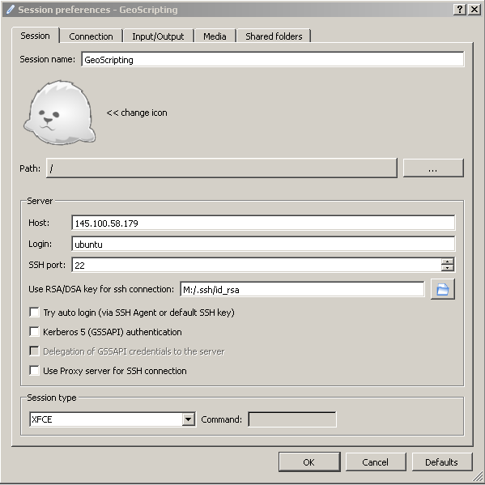
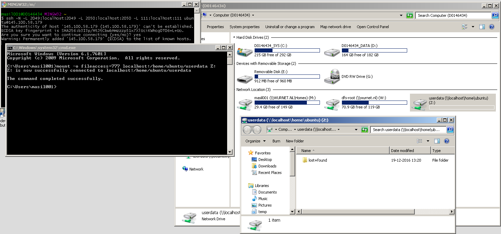

# Getting started with SURFsara cloud (in-browser)

First go to [https://portal.live.surfresearchcloud.nl/](https://portal.live.surfresearchcloud.nl/) and log in using your WUR account. Use [this link](https://sram.surf.nl/registration?collaboration=4873a9a3-15b8-4e10-9dde-a07262a3bdb6) to request access to the *Wageningen University Geoscripting* collaboration. We (the staff) have to accept access to this collaboration, and create a virtual machine (VM) for your group. In the meantime, you can set up your two factor authentication:

## Two factor authentication (2FA)

Navigate to your [profile page](https://portal.live.surfresearchcloud.nl/profile). Click the **Profile options** button, and then on **Reset Time based password**. You should get the following message: *"Are you sure you want to reset your password?"*. Press **Reset**. Follow the instructions to set up 2FA. You will need the 2FA code later for logging into the VM.

## Accessing the VM

Once you have been granted access to the *Wageningen University Geoscripting* collaboration *and* you have set up 2FA, you should be able to access your VM. Navigate back to the [starting page](https://portal.live.surfresearchcloud.nl/), and scroll down the page to the 'Workspaces' section. You should see multiple available workspaces (VMs). Please only make use of the workspace with your group name/number. If a workspace with your group name/number does not exist, please contact the staff.

At the right of every workspace, there should be a (yellow) button that allows access to the workspace. Press that button for the workspace you want to access. A login-page will show up. Enter the following information:

* Use the standard Session type (Xorg)
* Your username is your SURF researchcloud username, which is not the same as your WUR username (!). You can find your SURF username in your [profile page](https://portal.live.surfresearchcloud.nl/profile)
* Your password is the 2FA code

If your VM is coming out of 'sleep mode', and you have to fill in a password to unlock it, you should (again) make use of your 2FA code. Happy coding!

# Optional: accessing the VM from your own machine

The tutorial above allows you to access the VM in-browser. There are however alternatives to access the VM directly from your own machine, for which we provide a tutorial below.

## Enrol your SSH key

Navigate to your [SRAM profile page](https://sram.surf.nl/profile). Generate an SSH key on your own machine. Paste this SSH key into the text box, and click the "Save" button. Please refer to online tutorials to find/create an SSH key for your machine, like [this one](https://www.howtogeek.com/762863/how-to-generate-ssh-keys-in-windows-10-and-windows-11/) for Windows.

**Hint**: another easy way to find your SSH key is by running Git GUI on your own machine, though Help → Show SSH Key. 

## Log into the VM

There are two ways to log into your virtual machine (aside from the in-browser option): through a graphical interface using the *X2Go Client* software, and through a command line using *Git Bash*. To use the graphical interface, install and launch *X2Go Client* on Windows. After launch, the new session *Session Preferences* window will be opened automatically. Fill in the details as follows:

* Session name: Enter a descriptive name for your VM.
* Host: The IP address of your VM. It starts with "145.100" and you can see it in the *Virtual Machines* page.
* Login: *ubuntu*
* SSH port: Leave at *22*
* Use RSA/DSA key for ssh connection: The path to the *M:\\.ssh\id_rsa* file (**not** *id_rsa.pub*).
* Session type: *XFCE*

In addition, in the *Connections* tab you can set the compression method to "4k-png". This is a lower-colour setting that saves bandwith and thus makes the desktop more responsive.

Press OK, and from here on you can press the bubble on the right-hand side to launch the dektop of the virtual machine. You will see a *Host key verification failed* warning; this is expected every time you launch a new VM, answer *Yes*. You might also see a warning about shared folders and printers; this is safe to ignore. Turn off folder and printer sharing for the message to go away.

<!-- Likely all deprecated, and possibly also not relevant

## Shut down a VM

**Very important: Remember to properly shut down VMs that you are not actively using, as they take up precious resources from the cloud! If you do not, other students might not be able to start their own VMs.**

To properly shut down your VM, first you need to make sure your computer is no longer connected to it. If you have X2Go running, open the X2Go Client window again, and press the *Terminate* button on the lower right part of the main pane. This will gracefully log your user out.

Then on the SURFSara website, select your VM, press the *Power off* button and confirm *Send the power off signal*. Wait for the state to become *OFF*, then press the *Delete* button and confirm deletion.

**Important**: Only if your VM is **deleted** (does **not** show up in the *VMs* tab altogether) does it free the resources for other students to use!

## Saving changes

If you change something, then restart the VM, you may notice that your changes have been lost. This is because by default VM hard drives are not persistent. You need to clone them and set them as persistent to make the changes stick.

To do that, when your VM is in the *OFF* state, press the green floppy disk icon. Give your new template a descriptive name (for example, your name or the name of your group) and choose "Persistent". Wait a while while your changes are saved.

From here on, as long as you start the VM from the template in the *Saved* tab, the changes you do will be saved.

**Important**: Do not make more than one VM persistent, as it might go over the hard disk quota! If you want to start fresh, make sure your previous saved template is deleted first.

## File sharing

You might want to transfer files to or from the VM. There are two ways to do so. The more convenient method is to use *Network File System* (NFS) to access the VM drive as if it was a local hard drive. To do that, you need to establish a secure connection to the VM and map the network drive to your PC.

First, start *Git Bash*. This will open a terminal window. In it, enter: `ssh -N -L 2049:localhost:2049 -L 2050:localhost:2050 -L 111:localhost:111 ubuntu@<ip>` where `<ip>` is the IP address of your VM. This will establish a secure SSH connection to the VM on ports 2049, 2050 and 111 (the console getting stuck and seemingly nothing happening is good and expected). You can use this method for other applications and ports as well (such as to access RStudio Server on some VMs). When you are done, to disconnect the secure connection, press Ctrl+C in the Git Bash window, which brings you back to the `$` prompt.

To map the network drive, there are also two options. The GUI option is to open My Computer, press the *Map Network Drive* button, and enter `localhost:/home/ubuntu/userdata` (again, use the IP of your VM). Double-clicking on the drive, you will see a folder with nothing but an inaccesible `lost+found` folder. It is the */home/ubuntu/userdata* directory on the VM, and you can drag and drop files and folders to and from it. To disconnect, right-click on the network drive and click *Disconnect*.

**Note**: If the GUI option has Windows treating files you create as read-only, try mounting the remote drive by using the command line. To do that, run `cmd.exe` (Command Prompt) from the Start menu, then enter `mount -o fileaccess=777 localhost:/home/ubuntu/userdata Z:`. This will make the drive appear in My Computer just like the GUI method did, with all new files being treated as read-write.

Another, less complicated but also less convenient method to tranfer files is using the *Secure File Transfter Protocol* (SFTP). It is a command-line program that comes with SSH. You can use it for transferring any file you can access using SSH, so it is not limited to prespecified directories like NFS is. So you can use it to get or send files outside of your *userdata* directory.

To use it, open *Git Bash* again, and enter: `sftp ubuntu@<ip>`. This will give you a prompt in which you can enter commands. Use `get <file>` to download files and `put <file>` to upload them, where `<file>` is the path to the file. You can change the directory you download the files to by using `lcd <path>`, and the directory you download from by using `cd <path>`. Enter `?` for a complete list of commands, `exit` to quit. 

# References

* [Workshop on using SURFsara](https://doc.hpccloud.surfsara.nl/VU-20161019/index)
* [SURFsara documentation](https://doc.hpccloud.surfsara.nl/)

-->
