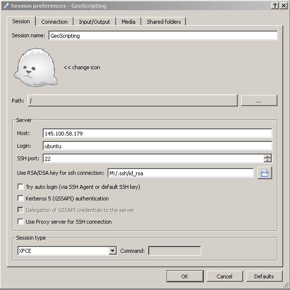
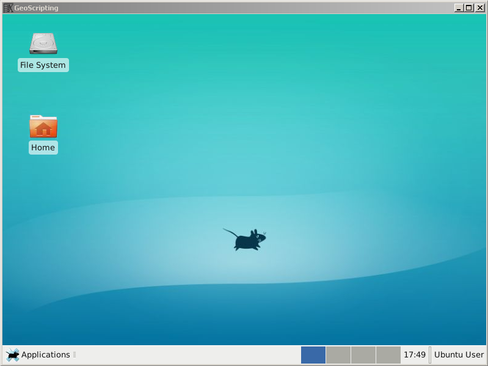
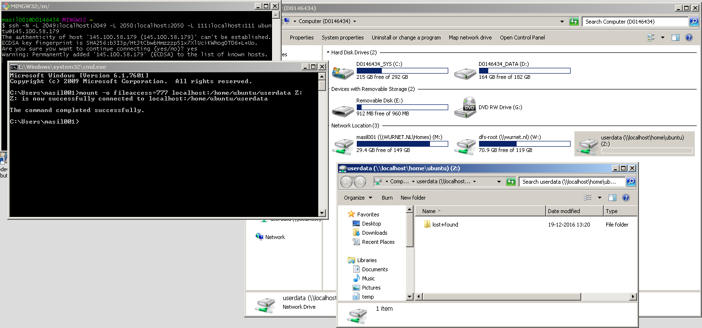

# Why cloud computing?

In the field of geo-information, the amount of available data is staggering. This *Big Data* is often too large to download and too intensive to process on a personal computer. Therefore data providers such as the European Space Agency and research organisations like SURFsara are now offering virtual machines (VM) running on their own cloud infrastructure for scientific purposes, so that this Big Data can be processed faster and more efficiently. These cloud VMs are typically running Linux distributions and have a whole lot of resources (processor cores, RAM, hard disk) available.

# Getting started with SURFsara cloud

## Enrol your SSH key

First go to [https://ui.hpccloud.surfsara.nl/](https://ui.hpccloud.surfsara.nl/) and log in with the credentials that have been provided to you by email. Each student has a unique account. Then, click on your username and go to Settings. Click "Update SSH Key" and paste the public key you generated in the previous lesson into the text box, and click the "Update SSH Key" button.

**Hint**: the easiest way to find it is by running Git GUI, though Help → Show SSH Key. In the PC lab the SSH keys are stored on the *M:* drive, so they are unique to the WUR user account. If you want to access the cloud from your own device, you will need to update the SSH key in your SURFsara account to the one on your device.

## Start a VM

<!--### "Cloud" view-->
You can start a virtual machine by going to the *VMs* tab and clicking the + button. Select the "Ubuntu 16.04 GeoScripting" template and press "Create" (do not change the size of the disks). Wait a bit until your VM enters the ready state (icon turns green).

<!--### "User" view
Next, press "Change view" and set it to "user". From the Dashboard, go to Virtual Resources → Templates, select the "Ubuntu 16.04 GeoScripting" template and press "Clone". Give it a name you like: this will become your very own virtual machine. A *Template* is a set of settings for your virtual machine, including the number of cores, memory and hard disks.

You can run it already by clicking on it and pressing "Instantiate", then confirming the settings by pressing "Instantiate" again. You will see your virtual machine running in the Virtual Resources → Virtual Machines page. -->

## Log into the VM

There are two ways to log into your virtual machine: through a graphical interface using the *X2Go Client* software, and through a command line using *Git Bash*. We will mainly use the graphical interface in this course. To do that, launch *X2Go Client* on Windows, and the new session *Session Preferences* window will be opened automatically. Fill in the details as follows:

* Session name: Enter a descriptive name for your VM.
* Host: The IP address of your VM. It starts with "145.100" and you can see it in the *Virtual Machines* page.
* Login: *ubuntu*
* SSH port: Leave at *22*
* Use RSA/DSA key for ssh connection: The path to the *M:\\.ssh\id_rsa* file (**not** *id_rsa.pub*).
* Session type: *XFCE*

In addition, in the *Connections* tab you can set the compression method to "4k-png". This is a lower-colour setting that saves bandwith and thus makes the desktop more responsive.

Press OK, and from here on you can press the bubble on the right-hand side to launch the dektop of the virtual machine. You will see a *Host key verification failed* warning; this is expected every time you launch a new VM, answer *Yes*. You might also see a warning about shared folders and printers; this is safe to ignore. Turn off folder and printer sharing for the message to go away.

## Shut down a VM

**Important**: Remember to properly shut down VMs you don't need, as they take up precious resources from the cloud! If you do not, other students might not be able to start their own VMs.

To properly shut down your VM, first you need to make sure your computer is no longer connected to it. If you have X2Go running, open the X2Go Client window again, and press the *Terminate* button on the lower right part of the main pane.

<!--### "Cloud" view-->

Then on the SURFSara website, select your VM, press the *Power off* button and confirm *Send the power off signal*. Wait for the state to become *OFF*, then press the *Delete* button and confirm deletion. *Only if your VM is deleted does it free the resources for other students to use!*

<!--### "User" view

Then on the SURFsara website, select your VM, press the garbage can button, and select *Shutdown*. -->

## Saving changes

If you change something, then restart the VM, you may notice that your changes have been lost. This is because by default VM hard drives are not persistent. You need to clone them and set them as persistent to make the changes stick.

<!--### "Cloud" view-->

To do that, when your VM is in the *OFF* state, press the green floppy disk icon. Give your new template a name and choose "Persistent". Wait a while while your changes are saved.

From here on, as long as you start the VM from the template in the *Saved* tab, the changes you do will be saved.

<!--### "User" view

To do that, go to the *Virtual Resources* → *Images* page on the SURFsara website. This is a list of hard disks available to your VMs. Select the *Ubuntu 16.04 GeoScripting* image, which is the operating system image, then click "Clone" and name it. Go back to the image listing, selected your cloned OS image, press on the three-dots button and choose "Make persistent".

You now have a persistent clone of the operating system. Now you need to tell the VM to use it. To do that, go to the *Templates* page, select the template and clone it. Select your cloned template and click *Update*. Go to the *Storage* tab and click on your cloned OS image, then click *Update* to confirm changes.

Now when you instantiate your cloned template, it will use the persistent image and allow you to make changes. In case something ever goes wrong with the VM, you can always delete the cloned image and reclone the original image to start fresh.

The OS image only has 10 GiB of space. In case it is not enough, such as for processing large rasters, you can add an additional hard drive to your VM and store your files on it.

To do that, repeat the cloning and template editing process, but this time with the *userdata shared drive* image. When editing your teplate file (you can keep updating the cloned template you already have), instead of replacing Disk 0, press the *Add another disk* button and choose your cloned *User data* image as Disk 1.

The space is then available in the *userdata* directory within your user directory (*/home/ubuntu/userdata*).-->

## File sharing

You might want to transfer files to or from the VM. There are two ways to do so. The more convenient method is to use *Network File System* (NFS) to access the VM drive as if it was a local hard drive. To do that, you need to establish a secure connection to the VM and map the network drive to your PC.

First, start *Git Bash*. This will open a terminal window. In it, enter: `ssh -N -L 2049:localhost:2049 -L 2050:localhost:2050 -L 111:localhost:111 ubuntu@<ip>` where `<ip>` is the IP address of your VM. This will establish a secure SSH connection to the VM on ports 2049, 2050 and 111 (the console getting stuck and seemingly nothing happening is good and expected). You can use this method for other applications and ports as well (such as to access RStudio Server on some VMs). When you are done, to disconnect the secure connection, press Ctrl+C in the Git Bash window, which brings you back to the `$` prompt.

To map the network drive, there are also two options. The GUI option is to open My Computer, press the *Map Network Drive* button, and enter `localhost:/home/ubuntu/userdata` (again, use the IP of your VM). Double-clicking on the drive, you will see a folder with nothing but an inaccesible `lost+found` folder. It is the */home/ubuntu/userdata* directory on the VM, and you can drag and drop files and folders to and from it. To disconnect, right-click on the network drive and click *Disconnect*.

The GUI option will have Windows treating files you create as read-only, however. To make it treat them as read-write, you need to use the command line option. To do that, run `cmd.exe` (Command Prompt) from the Start menu, then enter `mount -o fileaccess=777 localhost:/home/ubuntu/userdata Z:`. This will make the drive appear in My Computer just like the GUI method did.

Another, less complicated but also less convenient method to tranfer files is using the *Secure File Transfter Protocol* (SFTP). It is a command-line program that comes with SSH. You can use it for transferring any file you can access using SSH, so it is not limited to prespecified directories like NFS is. So you can use it to get or send files outside of your *userdata* directory.

To use it, open *Git Bash* again, and enter: `sftp ubuntu@<ip>`. This will give you a prompt in which you can enter commands. Use `get <file>` to download files and `put <file>` to upload them, where `<file>` is the path to the file. You can change the directory you download the files to by using `lcd <path>`, and the directory you download from by using `cd <path>`. Enter `?` for a complete list of commands, `exit` to quit. 

# References

* [Workshop on using SURFsara](https://doc.hpccloud.surfsara.nl/VU-20161019/index)
* [SURFsara documentation](https://doc.hpccloud.surfsara.nl/)
