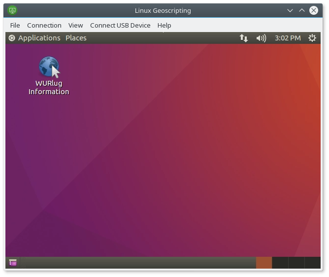

# Getting started with WUR VMWare Horizon Linux VDIs

## Cloud computing

The IT department of Wageningen University offers a remote desktop solution, where a virtual desktop environment (VDI; a virtual machine with a visual interface) is allocated to a user, who can then access and use it from anywhere in the world. Currently this solution is based on VMware Horizon virtualisation software. Both Windows and Linux VDIs are an option. For this course, each student has access to one Linux VDI for the duration of the course.

There are a number of organisations that offer such virtual machines for use in data processing, ranging from specialised satellite imagery exploitation platforms to commercial cloud computing hosting companies. Usually such virtual machines run a Linux distribution.

Working in a Linux environment, on a cloud computing instance, is one of the learning goals in this course. The VDIs have been prepared and tested for this course and come with a number of tools needed for this course preinstalled, so it is suggested that you make use of them throughout the whole course.

## Starting up a Linux VDI

Each WUR student should have access to one Linux VDI running Xubuntu 16.04 that has 2 cores, 4 GiB RAM and 50 GiB space. These resources are not dynamic; if you feel that you need more, feel free to run Linux on your own devices or on local virtual machines on the university machines. If you should have access to a VDI but don't appear to, please contact the course coordinators and/or the IT help desk.

The VDIs are always running. There are two ways to log in: via a client program or through a web browser.

### VMware Horizon Client

On university PCs, the VMware Horizon program is preinstalled, you can launch it from the Start menu. On your own computers or tablets, you can download the client from [here](https://www.vmware.com/go/viewclients).  When launched, you should see a server named `workspace.wur.nl` (on your own computers, add it manually).

If you click the options button in the top right and select `Configure VMware Blast`, you can choose the quality settings of remote connections. If you find the quality sufficient, leave the default options to save bandwidth. The VDIs are running in the local WUR network, however, due to the number of students accessing it at one time, bandwidth should nevertheless be conserved. You can increase the setting to `Excellent` if you need a higher quality image (but potentially slower response time), and deselect `H.264` if you need perfectly accurate colours in still images.

Log into the server by double-clicking the `workspace.wur.nl` icon. Here, you should see a list of VDIs. Double-click (or right-cick and `Launch`) the VDI that is called `Linux Geoscripting`. You should then be automatically logged into the VDI and see the Xfce desktop.

### MyWorkspace

You can also access the VDI from your web browser without installing a client. For that, go to [MyWorkspace](http://myworkspace.wur.nl), log in with your WUR username (without any prefix) and password, and click `Open` below the `Linux Geoscripting` VDI in the `Catalog` tab (or click on the name, then click `Launch`).

Note, however, that the web version has a few limitations compared to the desktop client. For one, modifier keys (Alt, etc.) are captured by the browser rather than the VDI, and clipboard sharing is more complicated. In addition, launching the VDIs seems to take longer or time out from the web interface at times.

## Using the Linux VDI

You can use the VDI as a regular Linux desktop machine. From the file manager (Thunar) you should be able to see your network shares mounted ("M" is your personal share, M: drive on Windows; "W" is the read-only university share, W: drive on Windows). Printing to `WURprinter` should work as well (the print jobs should appear on the university's printers).

Each VDI is personal. You have root access to your VDI, running `sudo` will ask for your WUR password.

If need be, you can connect to your VDI via SSH from inside the WUR network. You can find your VDI's IP by running `ip address` in the terminal, and you can log into it by running `ssh <username>@<ip>`, provided that you set up an SSH authentication mechanism. You can also connect to servers (such as Jupyter or RStudio) this way.

## Stopping the Linux VDI

The VDIs at the moment are made to be always running. Do not shut them down, otherwise you will not be able to start them back up without contacting IT support! The clean way to terminate a VDI session is to log out. You can do this from the Whisker menu → *Log Out* (power symbol), this will stop your session automatically and quit the VMware Horizon client. You can also log out from the VMware Horizon client by pressing the `Log off` button.

If you wish to leave the VDI running without stopping all programs, you can just close the VMware Horizon client window. The next time you log in, you will be back where you left off, with all programs running.

## Troubleshooting issues

In case something goes wrong, you are able to restart the VDI from the client. There are two options: `Restart` and `Reset` (in the desktop client they are in the menu bar and in the context menu when you right-click on a VDI; on MyWorkspace they are in the sidebar). `Restart` restarts the VDI gracefully (it asks Linux to restart itself). `Reset` is a forced restart, equivalent to cutting the power, which may lead to loss of data, so use that only as a last resort. Either way it might take up to 10 minutes for the restart to finish.

At the moment of writing, the `W` network share sometimes disconnects, you need a restart to make it reappear again.

In case of technical problems with VDI instances themselves (and not the software on them) that you cannot solve yourself, accidental shutdowns, or for catastrophic failures that would require a reset of your VDI to the initial state, you can [write an email to the IT helpdesk](http://www.wur.nl/en/Education-Programmes/Current-Students/ICT-related-questions.htm), mentioning Linux VDI in the email header.

